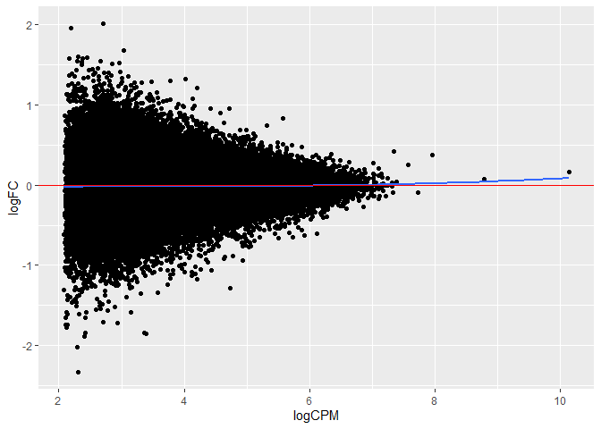
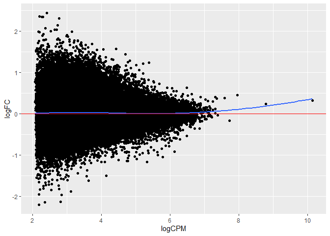

Genome Informatics A6
================
Charlotte Barclay
24/02/2021

  - [Part 1: understanding the
    experiment](#part-1-understanding-the-experiment)
      - [`#?#` *Make the above plot. Each point should represent one of
        the samples. - 1
        pt*](#-make-the-above-plot-each-point-should-represent-one-of-the-samples---1-pt)
      - [`#?#` *Can we compare BRM014 to DMSO across all time points?
        Why/why not? - 1
        pt*](#-can-we-compare-brm014-to-dmso-across-all-time-points-whywhy-not---1-pt)
  - [Part 2: QC](#part-2-qc)
      - [`#?#` Make a plot with read coverage on the y-axis (total
        number of reads) and the samples on the x-axis. - 3
        pt\*](#-make-a-plot-with-read-coverage-on-the-y-axis-total-number-of-reads-and-the-samples-on-the-x-axis---3-pt)
      - [`#?#` *Which sample has the most coverage? - 0.5
        pt*](#-which-sample-has-the-most-coverage---05-pt)
      - [`#?#` *Which sample has the least? - 0.5
        pt*](#-which-sample-has-the-least---05-pt)
      - [`#?#` *What is the % difference between the max and min
        (relative to the min)? - 0.5
        pt*](#-what-is-the--difference-between-the-max-and-min-relative-to-the-min---05-pt)
      - [`#?#` *Create a new data.frame containing only the BI\_protac
        and control samples - 1
        pt*](#-create-a-new-dataframe-containing-only-the-bi_protac-and-control-samples---1-pt)
      - [`#?#` *For this subset, calculate the counts per million reads
        (CPM) for each sample - 2
        pt*](#-for-this-subset-calculate-the-counts-per-million-reads-cpm-for-each-sample---2-pt)
      - [`#?#` *Plot the kernel density estimate for CPM (x axis). 1
        curve per sample, different colours per curve. - 1
        pt*](#-plot-the-kernel-density-estimate-for-cpm-x-axis-1-curve-per-sample-different-colours-per-curve---1-pt)
      - [`#?#` *Plot the kernel density estimate for log(CPM+1) (x
        axis), coloured as before - 1
        pt*](#-plot-the-kernel-density-estimate-for-logcpm1-x-axis-coloured-as-before---1-pt)
      - [`#?#` *Why do you think log-transforming is usually performed
        when looking at genomics data? What about adding 1 before log
        transforming? - 2
        pt*](#-why-do-you-think-log-transforming-is-usually-performed-when-looking-at-genomics-data-what-about-adding-1-before-log-transforming---2-pt)
      - [`#?#` *Some regions have very large CPMs. Inspect the peaks for
        which CPM\>400. What do you notice about them? 3
        pt*](#-some-regions-have-very-large-cpms-inspect-the-peaks-for-which-cpm400-what-do-you-notice-about-them-3-pt)
      - [`#?#` *Calculate the pairwise correlations between log(CPM+1)s
        for the samples and plot them as a heatmap (samples x samples) -
        3
        pt*](#-calculate-the-pairwise-correlations-between-logcpm1s-for-the-samples-and-plot-them-as-a-heatmap-samples-x-samples---3-pt)
      - [`#?#` *What do you expect the correlations between replicates
        to look like? Is that what you see? - 2
        pt*](#-what-do-you-expect-the-correlations-between-replicates-to-look-like-is-that-what-you-see---2-pt)
      - [`#?#` *Filter your data, retaining only regions where the
        average counts per sample is greater than 10, and also remove
        mitochondrial regions - 3
        pt*](#-filter-your-data-retaining-only-regions-where-the-average-counts-per-sample-is-greater-than-10-and-also-remove-mitochondrial-regions---3-pt)
      - [`#?#` *How many peaks did you have before? How many do you have
        now? - 1
        pt*](#-how-many-peaks-did-you-have-before-how-many-do-you-have-now---1-pt)
  - [Part 3: Differential ATAC](#part-3-differential-atac)
      - [`#?#` *Make a count matrix called `countMatrix` for the
        BI\_protac and control samples, including only the peaks we
        retained above - 2
        pt*](#-make-a-count-matrix-called-countmatrix-for-the-bi_protac-and-control-samples-including-only-the-peaks-we-retained-above---2-pt)
      - [`#?#` *Make an MA plot for allDEStatsPairedTreatControlvsProtac
        -2pt*](#-make-an-ma-plot-for-alldestatspairedtreatcontrolvsprotac--2pt)
      - [`#?#` *Make an MA plot for allDEStatsPairedTime6vs24 - 1
        pt*](#-make-an-ma-plot-for-alldestatspairedtime6vs24---1-pt)
      - [`#?#` *Perform the same differential peak analysis using loess
        regularization. - 1
        pt*](#-perform-the-same-differential-peak-analysis-using-loess-regularization---1-pt)
      - [`#?#` *Make the same two MA plots as before, but this time
        using the loess normalized analysis - 1
        pt*](#-make-the-same-two-ma-plots-as-before-but-this-time-using-the-loess-normalized-analysis---1-pt)
      - [`#?#` *What was the first normalization method? What changed in
        the MA plots? Which analysis do you think is more reliable and
        why? - 4
        pt*](#-what-was-the-first-normalization-method-what-changed-in-the-ma-plots-which-analysis-do-you-think-is-more-reliable-and-why---4-pt)
  - [Part 4: GC bias](#part-4-gc-bias)
      - [`#?#` *Convert the region IDs to a GRanges object - 3
        pt*](#-convert-the-region-ids-to-a-granges-object---3-pt)
      - [`#?#` *Extract the genomic DNA sequences for each peak using
        hg38 - 3
        pt*](#-extract-the-genomic-dna-sequences-for-each-peak-using-hg38---3-pt)
      - [`#?#` *Create scatter plots (one per sample, e.g. using
        facet\_wrap), including lines of best fit (GAM), where each plot
        shows GC content (x axis) vs CPM (y axis) for each peak (points)
        -2pt*](#-create-scatter-plots-one-per-sample-eg-using-facet_wrap-including-lines-of-best-fit-gam-where-each-plot-shows-gc-content-x-axis-vs-cpm-y-axis-for-each-peak-points--2pt)
      - [`#?#` *Repeat the above, but this time showing only the lines
        of best fit and all on the same plot - 2
        pt*](#-repeat-the-above-but-this-time-showing-only-the-lines-of-best-fit-and-all-on-the-same-plot---2-pt)
      - [`#?#` *Given this result, predict whether we will see a
        significant relationship between GC content and logFC in our
        differential peak analysis (loess-normalized). Justify your
        prediction. Predicting “wrong” will not be penalized, as long as
        your justification is correct. Don’t retroactively change your
        answer. - 2
        pt*](#-given-this-result-predict-whether-we-will-see-a-significant-relationship-between-gc-content-and-logfc-in-our-differential-peak-analysis-loess-normalized-justify-your-prediction-predicting-wrong-will-not-be-penalized-as-long-as-your-justification-is-correct-dont-retroactively-change-your-answer---2-pt)
      - [`#?#` *Plot the relationship between GC and logFC for the
        loess-normalized ControlvsProtac analysis. Also include a line
        of best fit (blue) and y=0 (red) - 2
        pt*](#-plot-the-relationship-between-gc-and-logfc-for-the-loess-normalized-controlvsprotac-analysis-also-include-a-line-of-best-fit-blue-and-y0-red---2-pt)
      - [`#?#` *Now plot the same thing for the NON loess-normalized
        ControlvsProtac analysis. - 1
        pt*](#-now-plot-the-same-thing-for-the-non-loess-normalized-controlvsprotac-analysis---1-pt)
      - [`#?#` *Was your prediction correct? Do you think we should also
        account for GC normalization in our differential ATAC analysis?
        Why/why not? - 3
        pt*](#-was-your-prediction-correct-do-you-think-we-should-also-account-for-gc-normalization-in-our-differential-atac-analysis-whywhy-not---3-pt)
  - [Part 5: Differential analysis
    results](#part-5-differential-analysis-results)
      - [`#?#` *Suppose we perform the analyses above, redoing the
        differential analysis once more with GC normalization, and also
        considering that we tested loess and the default normalization
        methods. Did we P-hack? Why or why not? - 2
        pt*](#-suppose-we-perform-the-analyses-above-redoing-the-differential-analysis-once-more-with-gc-normalization-and-also-considering-that-we-tested-loess-and-the-default-normalization-methods-did-we-p-hack-why-or-why-not---2-pt)
      - [`#?#` *Now considering the two comparisons (6 vs 24 hours, and
        protac vs control). EdgeR performed a correction for MHT, but if
        we want to analyze the results from both comparisons, do we need
        to re-adjust to account for the fact that we tested two
        different hypothesis sets (time and treatment)? Why/not? - 2
        pt*](#-now-considering-the-two-comparisons-6-vs-24-hours-and-protac-vs-control-edger-performed-a-correction-for-mht-but-if-we-want-to-analyze-the-results-from-both-comparisons-do-we-need-to-re-adjust-to-account-for-the-fact-that-we-tested-two-different-hypothesis-sets-time-and-treatment-whynot---2-pt)
      - [`#?#` *How many differential peaks did you find (FDR\<0.01). -
        1 pt*](#-how-many-differential-peaks-did-you-find-fdr001---1-pt)
      - [`#?#` *Make a volcano plot of the
        allDEStatsPairedTreatControlvsProtac, with -log10(p-value) on
        the y axis and logFC on the x. Colour points that are
        significant at an FDR\<0.01. - 2
        pt*](#-make-a-volcano-plot-of-the-alldestatspairedtreatcontrolvsprotac-with--log10p-value-on-the-y-axis-and-logfc-on-the-x-colour-points-that-are-significant-at-an-fdr001---2-pt)
      - [`#?#` *Plot the logCPM (x axis) by -log10(Pvalue) (y axis),
        again colouring by FDR\<0.01. - 2
        pt*](#-plot-the-logcpm-x-axis-by--log10pvalue-y-axis-again-colouring-by-fdr001---2-pt)
      - [`#?#` *Do you think our initial filtering on peaks with at
        least 10 reads on average per sample was a good choice? Why or
        why
        not?*](#-do-you-think-our-initial-filtering-on-peaks-with-at-least-10-reads-on-average-per-sample-was-a-good-choice-why-or-why-not)

``` r
#install any of these you might not have already
library(tidyverse)
```

    ## -- Attaching packages --------------------------------------- tidyverse 1.3.0 --

    ## v ggplot2 3.3.3     v purrr   0.3.4
    ## v tibble  3.0.5     v dplyr   1.0.3
    ## v tidyr   1.1.2     v stringr 1.4.0
    ## v readr   1.4.0     v forcats 0.5.1

    ## -- Conflicts ------------------------------------------ tidyverse_conflicts() --
    ## x dplyr::filter() masks stats::filter()
    ## x dplyr::lag()    masks stats::lag()

``` r
library(ggplot2)
library(edgeR)
```

    ## Loading required package: limma

``` r
library(reshape)
```

    ## 
    ## Attaching package: 'reshape'

    ## The following object is masked from 'package:dplyr':
    ## 
    ##     rename

    ## The following objects are masked from 'package:tidyr':
    ## 
    ##     expand, smiths

``` r
library(dplyr)
library(tidyr)
library(heatmaps)
```

    ## 
    ## Attaching package: 'heatmaps'

    ## The following object is masked from 'package:base':
    ## 
    ##     scale

*Today we will be looking at a differential ATAC-seq dataset between
cells treated with an anti BAF protac and control (untreated) cells. The
cell type is HAP1, a cancer cell line with a near-haploid genome. We
will use this dataset to explore differential analysis. *

*The GEO entry is located here, where you can read more about the
experiments:
<https://www.ncbi.nlm.nih.gov/geo/query/acc.cgi?acc=GSE148175> *

*This is the paper: <https://www.nature.com/articles/s41588-021-00777-3>
*

*“Acute BAF perturbation causes immediate changes in chromatin
accessibility”*

``` r
#download the data
atacSeqData = read.table(textConnection(readLines(gzcon(url("ftp://ftp.ncbi.nlm.nih.gov/geo/series/GSE148nnn/GSE148175/suppl/GSE148175_count_matrix_raw_atac_BRM014_ACBI1.csv.gz")))), 
                      sep=",", stringsAsFactors = FALSE, header = TRUE)
```

``` r
#create a sample metadata data.frame
samples = data.frame(ID = names(atacSeqData)[2:ncol(atacSeqData)])
samples$replicate = gsub("(R[12])_([0-9]+[minh]+)_(.*)$","\\1",samples$ID)
samples$timeName = gsub("(R[12])_([0-9]+[minh]+)_(.*)$","\\2",samples$ID)
samples$treatment = gsub("(R[12])_([0-9]+[minh]+)_(.*)$","\\3",samples$ID)
samples$treatment[samples$treatment=="N"]="BRM014"
samples$time= as.numeric(gsub("[a-z]*","",samples$timeName))
samples$time[grepl("min",samples$timeName)]=samples$time[grepl("min",samples$timeName)]/60
```

# Part 1: understanding the experiment

*Now using `samples` make a plot showing the experimental design, with
time on the x axis, treatment on the y axis, and one plot on the left
and one on the right for the two replicates (e.g. using `facet_grid`).*

### `#?#` *Make the above plot. Each point should represent one of the samples. - 1 pt*

``` r
ggplot(data = samples, aes(x = time, y = treatment)) + 
  geom_point()  + 
  facet_grid(~ replicate)
```

<!-- -->

``` r
#here, if the point is there, it means such a sample exists, if absent it means that there is no such sample
```

*In this study, one of the things they were comparing was BRM014 to
DMSO. The drug BRM014 is dissolved in DMSO, so DMSO alone is the
appropriate control to gauge the effect of BRM014.*

### `#?#` *Can we compare BRM014 to DMSO across all time points? Why/why not? - 1 pt*

No, we cannot compare BRM014 to DMSO across all time points as from the
plot above we can see data is not available for both. DMSO only has data
capture at time 0 and end (24 hours), while BRM014 has data at 0, 5, 10
and 30 minutes, 1 hour 6 hours and 24 hours.

# Part 2: QC

*With most genomics data, it is important that both samples have
sufficient coverage, and that the samples have similar coverage. Either
case can lead to underpowered analysis, or misleading results. Calculate
the read coverage for each sample. *

### `#?#` Make a plot with read coverage on the y-axis (total number of reads) and the samples on the x-axis. - 3 pt\*

``` r
melt.atacSeqData <- melt(atacSeqData, id = "region")

total_reads <- melt.atacSeqData %>%
  group_by(variable) %>%
  summarise(read_coverage = sum(value)) 
  colnames(total_reads) <- c("ID", "read_coverage")


sample_reads_coverage <- left_join(samples, total_reads, by = "ID") 


ggplot(data = sample_reads_coverage) + 
geom_point(mapping = aes(x = ID, y = read_coverage)) + theme(axis.text.x = element_text(angle = 90))
```

<!-- -->

``` r
# there are many ways you could do this; one of which is using the melt/cast functions from reshape
```

### `#?#` *Which sample has the most coverage? - 0.5 pt*

``` r
sample_reads_coverage$ID [which.max(sample_reads_coverage$read_coverage)]
```

    ## [1] "R1_24h_DMSO"

### `#?#` *Which sample has the least? - 0.5 pt*

``` r
sample_reads_coverage$ID [which.min(sample_reads_coverage$read_coverage)]
```

    ## [1] "R1_6h_control"

### `#?#` *What is the % difference between the max and min (relative to the min)? - 0.5 pt*

``` r
maxCov <- max(sample_reads_coverage$read_coverage)
minCov <- min(sample_reads_coverage$read_coverage)
((maxCov - minCov)/minCov)*100
```

    ## [1] 100.1533

*In cases where samples have vastly different coverage, you can
potentially down-sample the higher-coverage samples. Sometimes, throwing
out the data in this way can also introduce new problems, so we’re going
to stick with the data we have.*

*For this assignment, we will look only at BI\_protac vs control data. *

### `#?#` *Create a new data.frame containing only the BI\_protac and control samples - 1 pt*

``` r
BiConData <- atacSeqData %>% select(contains(c("region", "BI_prot", "control"))) 
```

### `#?#` *For this subset, calculate the counts per million reads (CPM) for each sample - 2 pt*

``` r
BiConData <- BiConData %>%
  as.data.frame()

rownames(BiConData) <- BiConData$region

CpmBiCon <- cpm(BiConData[,-1])
```

### `#?#` *Plot the kernel density estimate for CPM (x axis). 1 curve per sample, different colours per curve. - 1 pt*

``` r
CpmBiConMelt <- melt(CpmBiCon) %>%
  rename(replace = c("X1" = "Region", "X2" = "Sample"))

ggplot(data = CpmBiConMelt, aes(x = value, colour = Sample)) +
  geom_density()
```

<!-- -->

### `#?#` *Plot the kernel density estimate for log(CPM+1) (x axis), coloured as before - 1 pt*

``` r
ggplot(data = CpmBiConMelt, aes(x = log(value + 1), colour = Sample)) +
  geom_density()
```

<!-- -->

### `#?#` *Why do you think log-transforming is usually performed when looking at genomics data? What about adding 1 before log transforming? - 2 pt*

You add 1 to avoid log(0) which is undefined. This way values of 0 are
1, log(1) = 0. Counts cannot be negative, so there will never be the
case that we have an origional value of -1 which is transformed to 0
when 1 is added to the count.

Log transformation makes expression or genomics data more symmetrical
allowing parametric statistical testing to be completed, providing a
more accurate and relevant answer.

### `#?#` *Some regions have very large CPMs. Inspect the peaks for which CPM\>400. What do you notice about them? 3 pt*

``` r
unique(HighCpm <- CpmBiConMelt %>%
  filter(value > 400) %>%
    pull(Region))
```

    ## [1] chr1:629688-630193 chr1:633778-634279 chrM:198-854       chrM:2059-2771    
    ## [5] chrM:2868-3973     chrM:12425-14404   chrM:14788-15943  
    ## 56617 Levels: chr1:100016999-100017500 ... chrX:9995680-9996238

7 regions have a CPM value greater than 400 and 5 out of these 7 are in
the Mitochondrial chromosomes.

*Normally, we would remove some of these regions before continuing (and
would redo the above steps). Since this is an assignment, we will
continue with the data as-is.*

*Often a good first step is to see if the data look good. One way to do
this is by seeing whether or not the signals in each sample correlate
with each other in ways you expect.*

### `#?#` *Calculate the pairwise correlations between log(CPM+1)s for the samples and plot them as a heatmap (samples x samples) - 3 pt*

``` r
Pairwise_BiCon <- cor(log(CpmBiCon +1))

heatmap(Pairwise_BiCon, symm = TRUE)
```

<!-- -->

### `#?#` *What do you expect the correlations between replicates to look like? Is that what you see? - 2 pt*

Pairwise comparisons are methods for analyzing population means in pairs
to, see if they are significantly different from one another. In this
case we would therefore expect the technical replicates to be the same,
or at least not statistically different from each other and therefore
cluster together. This is the case for our data *except* for
R1\_6h\_BI\_-\_protac and R2\_6h\_BI\_protac replicates

*It is common to exclude some regions from analysis. For instance, we
won’t be able to robustly identify those that are differential but have
low coverage even if they are truly differential, so there is no point
testing these. We will also remove mitochondrial regions, a common
contaminant of ATAC-seq data.*

### `#?#` *Filter your data, retaining only regions where the average counts per sample is greater than 10, and also remove mitochondrial regions - 3 pt*

``` r
BiConFilter <- BiConData%>%
  filter(rowSums(BiConData[,-1]) / 8 >10) %>%
  filter(!grepl("chrM", region))
```

### `#?#` *How many peaks did you have before? How many do you have now? - 1 pt*

``` r
nrow(BiConData)
```

    ## [1] 56617

``` r
nrow(BiConFilter)
```

    ## [1] 55471

There were 56617 peaks before filtering

After filtering peaks that had \<10 average reads per sample and 5
mitochondrial peaks, there are now 55471 peaks

# Part 3: Differential ATAC

*We want to know what regions are differentially accessible between
BI\_protac and the control.*

*Today, we’re going to use edgeR, which is designed for RNA-seq, but
works well on ATAC-seq as well. The user guide is here:*
<https://www.bioconductor.org/packages/release/bioc/vignettes/edgeR/inst/doc/edgeRUsersGuide.pdf>

### `#?#` *Make a count matrix called `countMatrix` for the BI\_protac and control samples, including only the peaks we retained above - 2 pt*

``` r
countMatrix <- as.matrix(BiConFilter[,-1])
```

*EdgeR is exceptionally versatile, with many different options for
analysis. Today, you’re going to use the GLM-quasi-likelihood approach
to calculate differential accessibility. We are providing the first
example analysis below, which you can modify in subsequent steps. You
will need to understand what the steps do, so read the appropriate
documentation. *

``` r
curSamples = samples[match(colnames(countMatrix), samples$ID),];
y = DGEList(counts=countMatrix, group=curSamples$treatment)
y = calcNormFactors(y)
designPaired = model.matrix(~curSamples$treatment + curSamples$timeName)  
# we are using timeName here to make sure that time is treated as a categorical variable. Had we more time points it might make sense to treat time as a value.
y = estimateDisp(y, designPaired)
fitPaired = glmQLFit(y, designPaired)
qlfPairedTime6vs24 = glmQLFTest(fitPaired, coef=3) 
qlfPairedTreatControlvsProtac = glmQLFTest(fitPaired, coef=2)
allDEStatsPairedTreatControlvsProtac = as.data.frame(topTags(qlfPairedTreatControlvsProtac,n=nrow(countMatrix)))
allDEStatsPairedTreatControlvsProtac$region=row.names(allDEStatsPairedTreatControlvsProtac)
allDEStatsPairedTime6vs24 = as.data.frame(topTags(qlfPairedTime6vs24,n=nrow(countMatrix)))
allDEStatsPairedTime6vs24$region=row.names(allDEStatsPairedTime6vs24)
```

*While the differential analysis has been done in this case, before we
look at the results, we are going to check if the data appear to be
normalized correctly. Also include a loess line of best fit, and the
line y=0.*

### `#?#` *Make an MA plot for allDEStatsPairedTreatControlvsProtac -2pt*

``` r
ggplot(allDEStatsPairedTreatControlvsProtac, aes(x = logCPM, y = logFC)) +
  geom_point() +
  geom_smooth(method = "loess", se = F) +
  geom_hline(yintercept = 0, color = "red")
```

    ## `geom_smooth()` using formula 'y ~ x'

<!-- -->

### `#?#` *Make an MA plot for allDEStatsPairedTime6vs24 - 1 pt*

``` r
ggplot(allDEStatsPairedTime6vs24, aes(x = logCPM, y = logFC)) + 
  geom_point() + 
  geom_smooth(method = "loess", se = F) +
  geom_hline(yintercept = 0, color = "red")
```

    ## `geom_smooth()` using formula 'y ~ x'

<!-- -->

*Now we’re going to test loess normalization instead.*

### `#?#` *Perform the same differential peak analysis using loess regularization. - 1 pt*

``` r
#Note: the Bioconductor package csaw implements loess regularization in a way that is compatible with edgeR
library(csaw)
```

    ## Loading required package: GenomicRanges

    ## Loading required package: stats4

    ## Loading required package: BiocGenerics

    ## Loading required package: parallel

    ## 
    ## Attaching package: 'BiocGenerics'

    ## The following objects are masked from 'package:parallel':
    ## 
    ##     clusterApply, clusterApplyLB, clusterCall, clusterEvalQ,
    ##     clusterExport, clusterMap, parApply, parCapply, parLapply,
    ##     parLapplyLB, parRapply, parSapply, parSapplyLB

    ## The following object is masked from 'package:limma':
    ## 
    ##     plotMA

    ## The following objects are masked from 'package:dplyr':
    ## 
    ##     combine, intersect, setdiff, union

    ## The following objects are masked from 'package:stats':
    ## 
    ##     IQR, mad, sd, var, xtabs

    ## The following objects are masked from 'package:base':
    ## 
    ##     anyDuplicated, append, as.data.frame, basename, cbind, colnames,
    ##     dirname, do.call, duplicated, eval, evalq, Filter, Find, get, grep,
    ##     grepl, intersect, is.unsorted, lapply, Map, mapply, match, mget,
    ##     order, paste, pmax, pmax.int, pmin, pmin.int, Position, rank,
    ##     rbind, Reduce, rownames, sapply, setdiff, sort, table, tapply,
    ##     union, unique, unsplit, which.max, which.min

    ## Loading required package: S4Vectors

    ## 
    ## Attaching package: 'S4Vectors'

    ## The following objects are masked from 'package:heatmaps':
    ## 
    ##     metadata, metadata<-

    ## The following objects are masked from 'package:reshape':
    ## 
    ##     expand, rename

    ## The following objects are masked from 'package:dplyr':
    ## 
    ##     first, rename

    ## The following object is masked from 'package:tidyr':
    ## 
    ##     expand

    ## The following object is masked from 'package:base':
    ## 
    ##     expand.grid

    ## Loading required package: IRanges

    ## 
    ## Attaching package: 'IRanges'

    ## The following objects are masked from 'package:dplyr':
    ## 
    ##     collapse, desc, slice

    ## The following object is masked from 'package:purrr':
    ## 
    ##     reduce

    ## The following object is masked from 'package:grDevices':
    ## 
    ##     windows

    ## Loading required package: GenomeInfoDb

    ## Loading required package: SummarizedExperiment

    ## Loading required package: MatrixGenerics

    ## Loading required package: matrixStats

    ## Warning: package 'matrixStats' was built under R version 4.0.4

    ## 
    ## Attaching package: 'matrixStats'

    ## The following object is masked from 'package:dplyr':
    ## 
    ##     count

    ## 
    ## Attaching package: 'MatrixGenerics'

    ## The following objects are masked from 'package:matrixStats':
    ## 
    ##     colAlls, colAnyNAs, colAnys, colAvgsPerRowSet, colCollapse,
    ##     colCounts, colCummaxs, colCummins, colCumprods, colCumsums,
    ##     colDiffs, colIQRDiffs, colIQRs, colLogSumExps, colMadDiffs,
    ##     colMads, colMaxs, colMeans2, colMedians, colMins, colOrderStats,
    ##     colProds, colQuantiles, colRanges, colRanks, colSdDiffs, colSds,
    ##     colSums2, colTabulates, colVarDiffs, colVars, colWeightedMads,
    ##     colWeightedMeans, colWeightedMedians, colWeightedSds,
    ##     colWeightedVars, rowAlls, rowAnyNAs, rowAnys, rowAvgsPerColSet,
    ##     rowCollapse, rowCounts, rowCummaxs, rowCummins, rowCumprods,
    ##     rowCumsums, rowDiffs, rowIQRDiffs, rowIQRs, rowLogSumExps,
    ##     rowMadDiffs, rowMads, rowMaxs, rowMeans2, rowMedians, rowMins,
    ##     rowOrderStats, rowProds, rowQuantiles, rowRanges, rowRanks,
    ##     rowSdDiffs, rowSds, rowSums2, rowTabulates, rowVarDiffs, rowVars,
    ##     rowWeightedMads, rowWeightedMeans, rowWeightedMedians,
    ##     rowWeightedSds, rowWeightedVars

    ## Loading required package: Biobase

    ## Welcome to Bioconductor
    ## 
    ##     Vignettes contain introductory material; view with
    ##     'browseVignettes()'. To cite Bioconductor, see
    ##     'citation("Biobase")', and for packages 'citation("pkgname")'.

    ## 
    ## Attaching package: 'Biobase'

    ## The following object is masked from 'package:MatrixGenerics':
    ## 
    ##     rowMedians

    ## The following objects are masked from 'package:matrixStats':
    ## 
    ##     anyMissing, rowMedians

``` r
countMatrix3b <- countMatrix

dimnames(countMatrix3b) <- NULL
z = SummarizedExperiment(list(counts=countMatrix3b))

z$totals <- colSums(countMatrix3b)

z = csaw::normOffsets(z)

z<- asDGEList(z)

z = estimateDisp(z, designPaired)
  fitPairedZ = glmQLFit(z, designPaired)
  qlfPairedTime6vs24_loess = glmQLFTest(fitPairedZ, coef=3) 
  qlfPairedTreatControlvsProtac_loess = glmQLFTest(fitPairedZ, coef=2)

allDEStatsPairedTreatControlvsProtac_loess = as.data.frame(topTags(qlfPairedTreatControlvsProtac_loess,n=nrow(countMatrix)))
allDEStatsPairedTreatControlvsProtac_loess$region=row.names(countMatrix)[as.numeric(rownames(allDEStatsPairedTreatControlvsProtac_loess))]

allDEStatsPairedTime6vs24_loess = as.data.frame(topTags(qlfPairedTime6vs24_loess,n=nrow(countMatrix)))
allDEStatsPairedTime6vs24_loess$region=row.names(countMatrix)[as.numeric(rownames(allDEStatsPairedTreatControlvsProtac_loess))]
```

### `#?#` *Make the same two MA plots as before, but this time using the loess normalized analysis - 1 pt*

``` r
ggplot(allDEStatsPairedTreatControlvsProtac_loess, aes(x = logCPM, y = logFC)) +
  geom_point() + 
  geom_smooth(method = "loess", se = F) + 
  geom_hline(yintercept = 0, color = "red")
```

    ## `geom_smooth()` using formula 'y ~ x'

<!-- -->

``` r
ggplot(allDEStatsPairedTime6vs24_loess, aes(x = logCPM, y = logFC)) +
  geom_point() + 
  geom_smooth(method = "loess", se = F) +
  geom_hline(yintercept = 0, color = "red")
```

    ## `geom_smooth()` using formula 'y ~ x'

<!-- -->

### `#?#` *What was the first normalization method? What changed in the MA plots? Which analysis do you think is more reliable and why? - 4 pt*

The first normalization method was TMM normalisation uses a weighted
trimmed mean of the log expression ratios.

Using the TMM approach, in the MA plot for
allDEStatsPairedTreatControlvsProtac, the blue loess line of best fit,
fluctuates above and below the y intercept (or M) 0 baseline. For the
allDEStatsPairedTime6vs24 there is less, but still present, fluctuation
around zero for the loess line of best fit.

The second normalization method is loess normalization. Loess
normalization first fit a smooth curve according to all data points in
the MAplot and then adjust the curve to the A component, so that all the
data points are scaled and M equals
0.[1](https://www.ncbi.nlm.nih.gov/pmc/articles/PMC6988798/#:~:text=loess%20normalization%20first%20fit%20a,%2C%20i.e.%2C%20M%20equals%200).

Using the loess normalisation, the data points seem to be better aligned
with y= 0, compared to the equivalent TMM normalised plot.

For log transformed data we are looking for the mean to be around zero
and therefore the line of best fit should be closest to zero. Therefore
the loess normalisation would appear to be the preferential method.

# Part 4: GC bias

*Next, we will look at potential GC bias in the data. We will again use
bioconductor *

### `#?#` *Convert the region IDs to a GRanges object - 3 pt*

``` r
#note that the names of your peaks are of the format <chr>:<startPos>-<endPos>
library(GenomicRanges)

chr <- strsplit2(BiConFilter$region,split = ":",)[,1]
range <- strsplit2(BiConFilter$region,split = ":",)[,2]

start <- as.numeric(strsplit2(range,split = "-",)[,1])
end <- as.numeric(strsplit2(range,split = "-",)[,2])

gen_ranges <- GRanges(seqnames = chr, ranges = IRanges(start = start, end = end))
names(gen_ranges) <- BiConFilter$region
```

### `#?#` *Extract the genomic DNA sequences for each peak using hg38 - 3 pt*

*See for relevant documentation:
<https://bioconductor.org/packages/release/workflows/vignettes/sequencing/inst/doc/sequencing.html>
*

``` r
library(Biostrings)
```

    ## Loading required package: XVector

    ## 
    ## Attaching package: 'XVector'

    ## The following object is masked from 'package:purrr':
    ## 
    ##     compact

    ## 
    ## Attaching package: 'Biostrings'

    ## The following object is masked from 'package:base':
    ## 
    ##     strsplit

``` r
library(BSgenome.Hsapiens.UCSC.hg38)
```

    ## Loading required package: BSgenome

    ## Loading required package: rtracklayer

``` r
seq <- getSeq(BSgenome.Hsapiens.UCSC.hg38, gen_ranges)

head(seq)
```

    ## DNAStringSet object of length 6:
    ##     width seq                                               names               
    ## [1]   591 CGCGCCGCGCCGGCGCAGGCGCA...TGCCAGGGCGCCCCCTGCTGGCG chr1:181169-181759
    ## [2]   848 AGCTGGGTCGACAGACAGGGGCT...TAGTCTCAATTTAAGAAGATCCC chr1:183590-184437
    ## [3]   502 TCAAACGAGGAGCCCCGCGCTGG...AATAAACCCACAGAAAATCCACC chr1:186575-187076
    ## [4]   626 TGTTAACTATAAGCTCAGTAGGG...CTGTCACCATTTCCTGTCGTCGT chr1:191183-191808
    ## [5]   506 ACACTCATCACAGCGCTAAGCTC...ATCTTAGCATACTCCTCAATTAC chr1:629688-630193
    ## [6]   502 CTCTATTGATCCCCACCTCCAAA...TCTACACTTATCATCTTCACAAT chr1:633778-634279

``` r
GC_content <- function(x){
  gc <- as.numeric(letterFrequency(x, "G") +
                   letterFrequency(x, "C"))/width(x)
  gc <- gc * 100
  return(gc)
}

gcpercent <- GC_content(seq)

mcols(gen_ranges) <- DataFrame(sequence = seq, GC = gcpercent) #Adding the sequence and GC info the Genomic ranges
```

*Now we will see if there’s any relationship between peak CPM and GC
content for each of the samples.*

### `#?#` *Create scatter plots (one per sample, e.g. using facet\_wrap), including lines of best fit (GAM), where each plot shows GC content (x axis) vs CPM (y axis) for each peak (points) -2pt*

``` r
#please limit the y axis to between 0 and 50

#CPM calculation for the filtered dataset
BiConFilter_GCJoin <- BiConFilter[,-1] %>% 
  cpm() %>% 
  as_tibble() %>% 
  mutate("region" = rownames(BiConFilter) )%>% 
  left_join(data.frame("region" = names(gen_ranges), "GC" = gen_ranges$GC), 
            by = "region") %>% 
  pivot_longer(cols = -c(region,GC) , names_to = "Sample") 

ggplot(BiConFilter_GCJoin, aes(x = GC, y = value)) + 
  geom_point(alpha = 0.5)+ 
  geom_smooth(method = "gam", se = F) + 
  ylim(0,50) +
  facet_wrap(~Sample)
```

    ## `geom_smooth()` using formula 'y ~ s(x, bs = "cs")'

    ## Warning: Removed 25872 rows containing non-finite values (stat_smooth).

    ## Warning: Removed 25872 rows containing missing values (geom_point).

<!-- -->

### `#?#` *Repeat the above, but this time showing only the lines of best fit and all on the same plot - 2 pt*

``` r
ggplot(BiConFilter_GCJoin, aes(x = GC, y = value, color = Sample)) + 
  geom_smooth(method = "gam", se = F) + 
  ylim(0,50)
```

    ## `geom_smooth()` using formula 'y ~ s(x, bs = "cs")'

    ## Warning: Removed 25872 rows containing non-finite values (stat_smooth).

<!-- -->

### `#?#` *Given this result, predict whether we will see a significant relationship between GC content and logFC in our differential peak analysis (loess-normalized). Justify your prediction. Predicting “wrong” will not be penalized, as long as your justification is correct. Don’t retroactively change your answer. - 2 pt*

Yes we will see a pattern of CPM abundance at certain GC content; as
high or low GC content tend to be under represented in RNA-seq and
therefore read counts may not be comparable between genes. As fold
change is the related to the number of a times a gene is over or under
expressed comparative to a baseline, the effect of GC content’s on CPM
will be directly influencing the logFC between samples.

### `#?#` *Plot the relationship between GC and logFC for the loess-normalized ControlvsProtac analysis. Also include a line of best fit (blue) and y=0 (red) - 2 pt*

``` r
GCvslogFC_Loess <- left_join(allDEStatsPairedTreatControlvsProtac_loess, data.frame("region" = names(gen_ranges), "GC" = gen_ranges$GC), 
            by = "region")

ggplot(GCvslogFC_Loess, aes(x = GC, y = logFC)) +
  geom_smooth(method = "gam", color = "blue") + 
  geom_hline(yintercept = 0, color = "red")
```

    ## `geom_smooth()` using formula 'y ~ s(x, bs = "cs")'

<!-- -->

### `#?#` *Now plot the same thing for the NON loess-normalized ControlvsProtac analysis. - 1 pt*

``` r
GCvslogFC_NOTLoess <- left_join(allDEStatsPairedTreatControlvsProtac, data.frame("region" = names(gen_ranges), "GC" = gen_ranges$GC), 
            by = "region")

ggplot(GCvslogFC_NOTLoess, aes(x = GC, y = logFC)) + 
  geom_smooth(method = "gam", color = "blue") + 
  geom_hline(yintercept = 0, color = "red")
```

    ## `geom_smooth()` using formula 'y ~ s(x, bs = "cs")'

<!-- -->

### `#?#` *Was your prediction correct? Do you think we should also account for GC normalization in our differential ATAC analysis? Why/why not? - 3 pt*

My prediction was correct. From the graph we can see that logFC is
elevated at both low and high GC content levels. Therefore it appears
that GC content did have an effect on logFC and we see comparatively
lower logFC at those GC content values where it had very high CPM for
all samples.

Yes, based on the graph results we can determine GC bias should be
accounted for, deciding on the appropriate normalisation at the
experimental design stage so we can correct for GC while doing
differential ATAC seq analysis. As we saw in the CPM vs GC graph above,
reads having certain level of GC would be favoured resulting in
increased reads, masking the actual difference between samples.

*We will leave GC normalization as an optional exercise, and will not
actually do it here.*

# Part 5: Differential analysis results

### `#?#` *Suppose we perform the analyses above, redoing the differential analysis once more with GC normalization, and also considering that we tested loess and the default normalization methods. Did we P-hack? Why or why not? - 2 pt*

Yes, as we retested or hypothesis multiple times, adding steps to keep
normalising our data based on the results we saw, rather than accounting
for this at the experimental design stage. This gave us results that
seemed to fit better with our hypothesis i.e. the ‘best’ or most
significant results, which fits the definition of p-hacking - the idea
that we ‘tend to seek evidence that confirms what we would like to
believe’ [2](https://www.wired.com/story/were-all-p-hacking-now/)

*Going forward, we will only use the initial analysis (**not loess
normalized**)*

### `#?#` *Now considering the two comparisons (6 vs 24 hours, and protac vs control). EdgeR performed a correction for MHT, but if we want to analyze the results from both comparisons, do we need to re-adjust to account for the fact that we tested two different hypothesis sets (time and treatment)? Why/not? - 2 pt*

As EdgeR performes a correction for multiple hypothesis testing I think
not. Also unless we are looking at interaction effects, I don’t think we
need to account for the two different hypothesis sets, as we analyse
these separately in the two different experimental sets. We don’t need
to test for multiple hypothese testing as we can just look at the top
differential results from both of these tests.

### `#?#` *How many differential peaks did you find (FDR\<0.01). - 1 pt*

``` r
nrow(allDEStatsPairedTreatControlvsProtac %>% # count rows (reflective of peaks)
  filter(FDR < 0.01) ) #for FDR < 0.01
```

    ## [1] 301

### `#?#` *Make a volcano plot of the allDEStatsPairedTreatControlvsProtac, with -log10(p-value) on the y axis and logFC on the x. Colour points that are significant at an FDR\<0.01. - 2 pt*

``` r
library(EnhancedVolcano)
```

    ## Loading required package: ggrepel

    ## Warning: package 'ggrepel' was built under R version 4.0.4

    ## Registered S3 methods overwritten by 'ggalt':
    ##   method                  from   
    ##   grid.draw.absoluteGrob  ggplot2
    ##   grobHeight.absoluteGrob ggplot2
    ##   grobWidth.absoluteGrob  ggplot2
    ##   grobX.absoluteGrob      ggplot2
    ##   grobY.absoluteGrob      ggplot2

``` r
EnhancedVolcano(allDEStatsPairedTreatControlvsProtac,lab = rownames(allDEStatsPairedTreatControlvsProtac), x = "logFC", y = "FDR", pCutoff = 0.01, subtitle = NULL, labSize = 2)
```

<!-- -->

### `#?#` *Plot the logCPM (x axis) by -log10(Pvalue) (y axis), again colouring by FDR\<0.01. - 2 pt*

``` r
ggplot(allDEStatsPairedTreatControlvsProtac, aes(x = logCPM, y = -log10(FDR))) +
  geom_point(alpha = 0.3) +
  geom_point(data = allDEStatsPairedTreatControlvsProtac[allDEStatsPairedTreatControlvsProtac$FDR <0.01,], aes(x = logCPM, y = -log10(FDR)), alpha = 0.5, color ="red")
```

<!-- -->

### `#?#` *Do you think our initial filtering on peaks with at least 10 reads on average per sample was a good choice? Why or why not?*

Yes because it enable us to better see patterns in the data without
looking at some of the noise. In the plot the density of the data points
with significant FDR decreases with lower CPM, therefore reads with a
lower CPM value seem to have little differential expression.

*At this point there are many other follow ups you can and would do for
a real differential analysis, but we leave these as optional exercises.
For example:* 1. Confirming that the differential peaks look correct
(e.g. CPM heatmap) 2. Confirming that peaks look differential on the
genome browser 3. Looking for motif enrichment 4. Performing a GREAT
analysis, including functional enrichment and assigning peaks to genes

*Knit your assignment as a github\_document and submit the resulting .md
and this .Rmd to your github, and complete the assignment submission on
Canvas. Make sure to include the graphs with your submission. *
