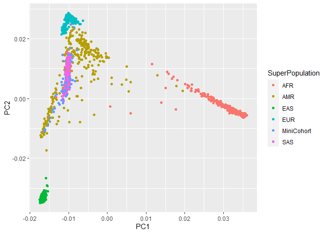

Assignment 7: PGS
================

  - [Assignment Overview](#assignment-overview)
  - [Getting Ready](#getting-ready)
  - [Genotyping Quality Control](#genotyping-quality-control)
      - [General QC](#general-qc)
      - [Global Ancestry Investigation](#global-ancestry-investigation)
      - [a. PCA-specific QC](#a-pca-specific-qc)
      - [b. PCA computation](#b-pca-computation)
      - [c. Visualization](#c-visualization)
  - [Polygenic Scores (PGS)](#polygenic-scores-pgs)
      - [PGS accuracy](#pgs-accuracy)

# Assignment Overview

In this assignment we will learn about population stratification,
imputation of genotypes, and using polygenic scores. Polygenic scores
(PGSs) can be useful for predicting disease susceptibility. In order to
calculate PGSs, we need two things: GWAS summary statistics (including
effect sizes), and genotypes. Most of the time, only a subset of a
person’s genotypes are actually measured (e.g. via SNP array), and so we
must impute the rest using a matched population of fully genotyped
individuals. This is the goal of Assignment 7.

Throughout the assignment we will be using a Mini Cohort that has
genetic data and some phenotypic variables, together with the 1000
Genomes Project samples. Both datasets are in bfile plink format, which
encompasses 3 files: *.bim, .bed and .fam* all the files can be located
under the following path: */usr/local/share/data/assignment\_7/*

# Getting Ready

In this assignment, we will be using the plink tool extensively. A plink
tutorial can be found here:
<https://zzz.bwh.harvard.edu/plink/tutorial.shtml>

``` bash

## Install plink1.9 onto your A1 conda environment:

conda activate Gnme_Assignment_1
conda install -n Gnme_Assignment_1 -c bioconda plink
```

# Genotyping Quality Control

## General QC

Before we can start working on the genetic data, we need to ensure that
the quality is adequate. Thus, we are gonna check the following
measuring for our MiniCohort:

1.  **SNP call rate:** The call rate represents the percentage of
    participants with non-missing data for that SNP. Removing variants
    with a call rate lower than 95% avoids potential wrong calls to be
    included in further analysis

2.  **Minor Allele Frequency:** The minor allele frequency (MAF) echoes
    the less common allele frequency across the population. The MAF
    estimates tend to be more accurate for higher MAFs and the
    population sample size the MAF was based on. If there are too few
    samples representing the rare-allele, is hard to distinguish between
    a true rare-allele and sequencing errors.

3.  **Sample call rate:** Similar to SNP call rate, it allows to filter
    out all samples exceeding 98% missing genetic variants out of all
    the calls.

<!-- end list -->

``` bash
## Using only one run of plink 1.9 (with different flags)
## 1. Filter out -SNPs- with more than 5% missingness
## 2. Filter out -variants- with less than 1% MAF
## 3. Filter out -samples- with more than 2% missingness
## 4. Create an output file in bfile format (which contains the bed, fam and bim files) for the MiniCohort QCed data

#?# Type the command you used below: - 3pt

plink --bfile /usr/local/share/data/assignment_7/Mini_cohort --mind 0.02 --maf 0.01 --geno 0.05 --make-bed --out ./Mini_CohortQC
```

**Output**

251658 variants loaded from .bim file.</br> 2504 people (1233 males,
1271 females) loaded from .fam.</br> 0 people removed due to missing
genotype data (–mind).</br> Using 1 thread (no multithreaded
calculations invoked).</br> Before main variant filters, 2497 founders
and 7 nonfounders present.</br> Calculating allele frequencies…
done.</br> 0 variants removed due to missing genotype data (–geno).</br>
623 variants removed due to minor allele threshold(s)
(–maf/–max-maf/–mac/–max-mac).</br> 251035 variants and 2504
people pass filters and QC.</br> Note: No phenotypes present.</br>

## Global Ancestry Investigation

In order to enhance imputation accuracy when dealing with ethnically
diverse cohorts is important to understand the genetic ancestries of the
cohort’s participants. Knowing the ancestral populations will ensure
that the most closely related population is used as a reference for the
imputation. For instance, one would not want to impute haplotypes of an
individual of Yoruban ancestry with a population of East Asians because
many of the haplotypes will differ between the two ancestries, leading
to imputing the wrong variants for the Yoruban person. Hence, we will
analyze the global ancestry of our cohort using Principal Component
Analysis (PCA). PCA is an unsupervised, unbiased way to reduce the
complexity of multidimensional.

## a. PCA-specific QC

We first need to ensure that only the most informative genetic variants
are used in the analysis. To do this, we will:

1.  **Filter out high linkage disequilibrium (LD) regions:** Because
    high LD regions will add redundancy to the PCA (leading to these
    regions dominating top PCs), they need to be removed.

2.  **LD pruning:** Similarly, LD causes redundancy even outside the
    particularly problematic high-LD regions. Thus, we will use
    LD-pruning to identify variants that are in LD, and select one per
    block.

<!-- end list -->

``` bash

## Using only one run of plink 1.9 (with different flags)
## 1. Filter out the high-LD regions contained in the --high_LD_regions_hg19.txt-- file, located in /usr/local/share/data/assignment_7/
## 2. Use the --indep-pairwise to do LD prunning with the following parameters:
## - Window size: 200, 
## - Variant Count: 100 
## - VIF (variance inflation factor): 0.2 
#?# Type the command you use to create the Mini Cohort PCA-QCed bfile below: - 1pt

plink --bfile ./Mini_CohortQC  --remove /usr/local/share/data/assignment_7/high_LD_regions_hg19.txt --indep-pairwise 200kb 100 0.2 --make-bed --out ./Mini_Cohort_LD_QC

## Use the output -.prune.in- file to extract only the informative variants and create a new bfile format (bed, fam and bim files) from:
## 1. The General MiniCohort QC bfile created before
## 2. The 1KGP_reference bfile located in /usr.local/share/data/assignment_7/

#?# Type the commands you used below: - 3pt

plink --bfile ./Mini_Cohort_LD_QC --extract ./Mini_Cohort_LD_QC.prune.in --make-bed --out ./Mini_Cohort_Pruned

plink --bfile /usr/local/share/data/assignment_7/1KGP_reference --make-bed --out ./1KGP_reference
```

## b. PCA computation

To assess the ethnic diversity in our cohort, we will use One-thousand
Genome Project (1KGP) data as a reference for our PCA analysis. These
dataset has genetic information of major continental populations:
Admixed American (AMR), European (EU), Asian (AS) and African (A).

``` bash

## Merge your pruned bfiles of the Mini_cohort and the 1KGP created on the previous step 
## Remember to create a new bfile (.fam, .bed and .bim files) that contains the merged data.
## IMPORTANT TIME CONSTRAINT: This step can take ~15 minutes, so make sure to check the server status before you run it!
#?# Type the command you used below: - 1pt

plink --bfile ./Mini_Cohort_Pruned --bmerge ./1KGP_reference --make-bed --out ./merged


#?# Perform a PCA analysis in plink on the merged set - 1 pt

plink --bfile ./merged --pca --out ./mergePCA
```

15831 MB RAM detected; reserving 7915 MB for main workspace. 2504 people
loaded from ./Mini\_Cohort\_Pruned.fam. 2504 people to be merged from
./1KGP\_reference.fam. Of these, 0 are new, while 2504 are present in
the base dataset. 219988 markers loaded from ./Mini\_Cohort\_Pruned.bim.
251658 markers to be merged from ./1KGP\_reference.bim. Of these, 31670
are new, while 219988 are present in the base dataset. Performing
single-pass merge (2504 people, 251658 variants).

## c. Visualization

``` r
## Copy the PCA .eigenvec file to your computer, together with the samples_info.txt located in /usr/local/share/data/assignment_7/

pscp -P 22 cbarcl01@gi-edu-sv4.bme.ubc.ca:/home/cbarcl01/Assignment_7/mergePCA.eigenvec C:\Users\cbarc\OneDrive\Desktop

pscp -P 22 cbarcl01@gi-edu-sv4.bme.ubc.ca:/usr/local/share/data/assignment_7/samples_info.txt C:\Users\cbarc\OneDrive\Desktop
```

``` r
## Load the .eigenvec file onto R, change the column names to: FID, IID, PC1, PC2, PC3, ..., PC20
#?# Type the command you used below: - 1pt

library(tidyverse)
```

    ## -- Attaching packages --------------------------------------- tidyverse 1.3.0 --

    ## v ggplot2 3.3.3     v purrr   0.3.4
    ## v tibble  3.0.5     v dplyr   1.0.3
    ## v tidyr   1.1.3     v stringr 1.4.0
    ## v readr   1.4.0     v forcats 0.5.1

    ## Warning: package 'tidyr' was built under R version 4.0.4

    ## -- Conflicts ------------------------------------------ tidyverse_conflicts() --
    ## x dplyr::filter() masks stats::filter()
    ## x dplyr::lag()    masks stats::lag()

``` r
eigenvec <-read.table("C:/Users/cbarc/OneDrive/Desktop/git_temp/CB_BMEG591E-repository/Assignment_7/mergePCA.eigenvec")

PCA <- as_tibble(eigenvec)

PCA <- rename(PCA, FID = V1, IID = V2, PC1 = V3, PC2 = V4, PC3 = V5, PC4 = V6, PC5 = V7, PC6 = V8, PC7 = V9, PC8 = V10, PC9 = V11, PC10 = V12, PC11 = V13, PC12 = V14, PC13 = V15, PC14 = V16, PC15 = V17, PC16 = V18, PC17 = V19, PC18 = V20, PC19 = V21, PC20 = V22)
                      
head(PCA)
```

    ## # A tibble: 6 x 22
    ##     FID IID        PC1    PC2     PC3     PC4      PC5     PC6      PC7      PC8
    ##   <int> <chr>    <dbl>  <dbl>   <dbl>   <dbl>    <dbl>   <dbl>    <dbl>    <dbl>
    ## 1     0 HG00~ -0.0102  0.0271 0.0110  -0.0207  2.20e-3 0.00759  1.69e-3  0.0438 
    ## 2     0 HG00~ -0.0103  0.0271 0.0105  -0.0200  2.69e-3 0.0111  -1.34e-4 -0.0101 
    ## 3     0 HG00~ -0.0102  0.0270 0.0108  -0.0182  1.89e-3 0.0154   3.56e-3  0.0593 
    ## 4     0 HG00~ -0.00993 0.0273 0.00997 -0.0196 -1.16e-4 0.00474  1.06e-2  0.0635 
    ## 5     0 HG00~ -0.0103  0.0267 0.0112  -0.0190  4.54e-4 0.0106  -2.26e-3  0.00663
    ## 6     0 HG00~ -0.0105  0.0268 0.0105  -0.0194  7.94e-3 0.0170   1.98e-3  0.0464 
    ## # ... with 12 more variables: PC9 <dbl>, PC10 <dbl>, PC11 <dbl>, PC12 <dbl>,
    ## #   PC13 <dbl>, PC14 <dbl>, PC15 <dbl>, PC16 <dbl>, PC17 <dbl>, PC18 <dbl>,
    ## #   PC19 <dbl>, PC20 <dbl>

``` r
## Load the samples_info.txt file onto R, change the column names to: FID, IID, SuperPopulation, Population
#?# Tyoe the commands you used below: - 1pt
 
 
sampleInfo <- read.table("C:/Users/cbarc/OneDrive/Desktop/git_temp/CB_BMEG591E-repository/Assignment_7/samples_info.txt")
sampleInfo <- as_tibble(sampleInfo)

sampleInfo <- rename(sampleInfo, IID = V1, FID = V2, SuperPopulation = V3, Population = V4) 

sampleInfo %>% relocate(IID, .after = FID)
```

    ## # A tibble: 2,504 x 4
    ##      FID IID     SuperPopulation Population
    ##    <int> <chr>   <chr>           <chr>     
    ##  1     1 HG00096 EUR             GBR       
    ##  2     2 HG00097 EUR             GBR       
    ##  3     2 HG00099 EUR             GBR       
    ##  4     2 HG00100 EUR             GBR       
    ##  5     1 HG00101 EUR             GBR       
    ##  6     2 HG00102 EUR             GBR       
    ##  7     1 HG00103 EUR             GBR       
    ##  8     1 HG00105 EUR             GBR       
    ##  9     2 HG00106 EUR             GBR       
    ## 10     1 HG00107 EUR             GBR       
    ## # ... with 2,494 more rows

``` r
## Merge the .eigenvec and sample_info data.frames together using the IID column
## Tip: Look into the -merge- function!
#?# Type the command you used below: - 1pt

mergedData <- merge(PCA, sampleInfo, by="IID")
```

``` r
## Using ggplot create a scatterplot, using: 
## x-axis: PC1
## y-axis: PC2
## color: SuperPopulation - to use the Population information to color the samples and be able to appreciate population structure!
#?# Type the command you used below: 1pt

library(ggplot2)

ggplot(mergedData, aes(x = PC1 , y = PC2, colour = SuperPopulation )) + 
   geom_point()
```

<!-- -->

\#?\# Where do the cohort samples fall? Are they all clustered together?
- 1 pt

Our cohort samples are not as tightly clustered as some groups (for
instance the European population). The data points overlap with both AMR
- Admixed American, and SAS - South Asian.

\#?\# Which Population would you use as a reference for imputation?,
Why? - 1 pt

I would use the AMR as a reference for imputation, because although the
points overlap with the SAS popultaion as well, the points extend
outside of the SAS cluster. Our cohort data points are completely within
the AMR cluster. However, there is still large variance and overlap
between populations which makes this decision difficult.

\#?\# Do you think looking at the top two PCs is sufficient to tell what
population is best? Why/why not? - 2 pt

```` 

# Imputation

Imputation of genetic data is a very computationally intensive analysis, that can take a long time. So we have performed it for you. Using the chromosome 17 imputation information located in */usr/local/share/data/assignment_7/* under the *Mini_cohort_chr17_imputation_results.info.gz* we will calculate some post-imputation metrics. 


```r
## Load the Mini_cohort_chr17_imputation_results.info.gz file to your Rstudio environment 
### Copy to local machine

pscp -P 22 cbarcl01@gi-edu-sv4.bme.ubc.ca:/usr/local/share/data/assignment_7/Mini_cohort_chr17_imputation_results.info C:\Users\cbarc\OneDrive\Desktop
````

``` r
## Load the Mini_cohort_chr17_imputation_results.info.gz file to your Rstudio environment 
chr17 <-read.table("C:/Users/cbarc/OneDrive/Desktop/git_temp/CB_BMEG591E-repository/Assignment_7/Mini_cohort_chr17_imputation_results.info.gz")

chr17 <- as_tibble(chr17)

##Use the information in the file to answer the following questions. Accompany each of the answers with the code you used to get to them and a brief explanation of your thought process behind.
#?# What is the percentage of imputed SNPs? 0.5 pt


## The metric of imputation quality is Rsq, this is the estimated value of the squared correlation between imputed and true genotypes. Since true genotypes are not available, this calculation is based on the idea that poorly imputed genotype counts will shrink towards their expectations based on allele frequencies observed in the population (https://genome.sph.umich.edu/wiki/Minimac3_Info_File#Rsq).  An Rsq < 0.3 is often used to flag poorly imputed SNPs. 
#?# What is the percentage of poorly imputed SNPs?


#?# Create a histogram to visualize the distribution of the MAF - 1 pt
```

\#?\# Which MAF is most frequent? What does that mean? - 1 pt

\#?\# What is the maximum MAF? Why is that? - 1 pt

# Polygenic Scores (PGS)

A GWAS for affinity for tapas (the Spanish appetizer) was performed and
199 SNPs were found significantly associated. The significant SNPs and
their assigned effect sizes are described in the
*Tapas\_enjoyability\_GWAS\_sumStats.txt* file. Thanks to the imputation
performed in our MiniCohort, we were able to obtain the dosages (double
risk alleles=2, one risk allele=1, no risk alleles=0) for each one of
the SNPs associated to the Tapas ‘enjoyability’, described in the
*MiniCohort\_Tapas\_SNPdosages.txt*.

PGS are calculated by multiplying the effect sizes of each SNP by the
dosage of an individual for those SNP and then adding together all the
effectSize x dosage. The formula is outlined below, where:

  - i: individual of which you are calculating the PGS

  - j: SNP that has been found to be associated to the trait (Tapas
    enjoyability in this case)

  - Beta: Effect size

  - dosage: number of risk alleles the *individual i* has of the *risk
    allele j*? (2,1 or 0)


``` r
## Load to your RStudio:
## 1.  -Tapas_enjoyability_GWAS_sumStats.txt-
## 2.  -MiniCohort_Tapas_SNPdosages.txt- 
## Both are located in the A7 directory on github.

## Using the base PRS formula outlined below, calculate the Tapas enjoyability PGS for the individuals in the Mini Cohort 
#?# Include your rationale and the documented code you used - 5pt


#?# Use ggplot to plot the distribution of the Tapas PGS: - 2 pt
## Include the code and the graph in your analysis! 
## Tip: http://www.cookbook-r.com/Graphs/Plotting_distributions_(ggplot2)/


#?# What is the distribution of the tapas PGS? - 1pt
```

## PGS accuracy

``` r
## The Tapas enjoyability was measured in a range of 0-1, with 0 being hating tapas and 1 being completely in love with tapas.
## This tapas likability is captured in the "Tapas_enjoyability" column of the -MiniCohort_Tapas_SNPdosages.txt- file. 
#?# Make a scatterplot with a linear regression line, where x is the Tapas-PGS and y is their actual Tapas enjoyability - 2 pt
## Tip: http://www.sthda.com/english/wiki/ggplot2-scatter-plots-quick-start-guide-r-software-and-data-visualization


#?# What is the correlation coeficient between the PGS and Tapas enjoyability? Is Spearman or Pearson correlation more appropriate here? Why? - 3 pt


#?# How predictive is the PGS for tapas preference? Include in your answer why do you think it is/isn't accurate and what could affect its predicitvity - 2pt 
```
