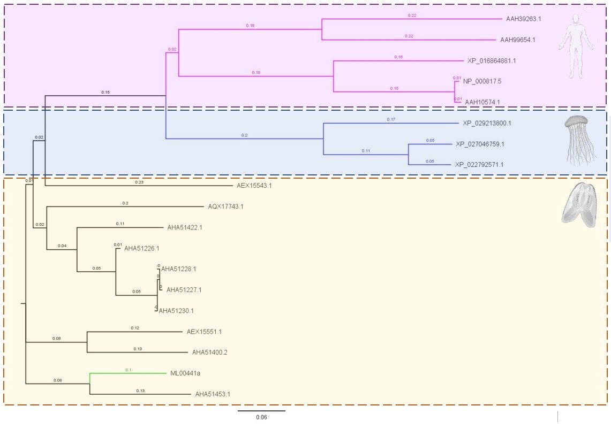

## 1 Introduction

### 1.1 Motivation

The origins of multicellularity is likely one of the hardest questions to tackle and it still fascinates and eludes scientists [1].  One of the main reasons is the fact that multicellularity likely was not a singular event in the history of life [2-4]. Accounts of the number of independent events that led to multicellularity differ amongst the scientific community [reference 2], although there is a consensus that this happened once in the Animalia/Metazoan lineage [5, 6]. Recent molecular evidence indicates that the earliest metazoan (i.e. first multicellular animal) traces 600 million years back [7, 8]. Ultimately, multicellularity is a fascinating topic of investigation as it highlights how convergent evolution can repeatedly employ the same strategy in face of a multitude of reasons, such as in response to selective pressures or, in a more speculative sense, due to some universal trajectory that life tends to follow.

Investigating the mechanisms that allows multicellularity to emerge is fundamental to properly formulate meaningful hypotheses that can link or (reveal the independency of) the multiple emergency of multicellularity events. Independent of the approach, nowadays this research is inseparable of genomics. Advances in sequencing and reduction in cost has led an increase in whole genomic sequences of non-bilateran animal species, providing insights into the molecular mechanisms that govern multicellularity [6-9].

Ctenophores have been proposed as a model organism for understanding the evolutionary mechanisms of multicellularity in animals [10-12], however their phylogenetic placement is still widely debated [10-12]. Ctenophores are a gelatinous phylum of marine metazoans with approximately 150 known species that form a clade of pre-bilateran animals [13]. Ctenophores haven't yet been fully explored and thus, they remain a promising and quite unknown group.


### 1.2 Original Study

The paper describes the first attempt to provide a reference genome to the ctenophore *Mnemiopsis leidyi*. Their results helped to propose Ctenophores as the sister-group to all other animals, also revealing a surprisingly complex set of neural genes similar to Sponges, providing another interesting question: if Ctenophores are the sister group and therefore, branching earlier than sponges, what happened to the nervous system in sponges? The results were provoking as they shook established hypothesis for the earliest branches of the animal tree of life. With the goal of understanding the emergence of multicellularity in animals, it only makes sense to spend efforts into having a reliable reference genome to one of the most promising model organisms for this research question [10].

##### 1.2.1 Sample collection and Genome Assembly

Ryan et al collected two wild animals from the Vineyard Sound near Woods Hole, Massachussets (Fig. 2) [10]. Those animals were self-fertilized and DNA was isolated from the resulting embryos of one of them. Details of the DNA isolation protocol were not disclosed, but the authors mention the use of "GS FLX Titanium Rapid Library Preparation Kit" and the "GS FLX Titanium Library Paired End Adaptors Kit". The resulting isolated DNA was used for sequencing using a Roche 454 Genome Sequencer FLX machine located at the Roche Applied Science centre in Indianapolis, IN. 7,334,972 raw reads with an Average read length of 339 bases were generated in nine runs, yielding 2.5 Gb of sequence.


Raw reads were then submitted for assembly using the Phusion assembler [14], resulting in 24,884 contigs with a total of 150,340,428 bases and a reported N50 of 11,936 bases. The authors proceeded to sequence the embryos of the second wild animal using Illumina GA-iiX system. The resulting paired-end reads were filtered, mapped to the 24,884 assembled contigs using Illumina's short read aligner ELAND, and integrated into Phusion's scaffolding step. This resulted in 5,100 scaffolds with an N50 of 187 Kb and an coverage of 160X.

#### 1.2.2 Evaluation of completeness and correctness of genome assembly

The authors extracted 15,752 M. leidyi Expressed Sequence Tags (ESTs) and aligned them to their assembled genome using BLAT [15] v. 34x12 with default parameters. They evaluated their alignment using a software developed by their group called baa.pl [16] later reformed into Isoblat (https://github.com/josephryan/isoblat/blob/master/Makefile.PL) and obtained:

The paper describes the first attempt to provide a reference genome to the ctenophore *Mnemiopsis leidyi*. Their results helped to propose Ctenophores as the sister-group to all other animals, also revealing a surprisingly complex set of neural genes similar to Sponges, providing another interesting question: if Ctenophores are the sister group and therefore, branching earlier than sponges, what happened to the nervous system in sponges? The results were provoking as they shook established hypothesis for the earliest branches of the animal tree of life. With the goal of understanding the emergence of multicellularity in animals, it only makes sense to spend efforts into having a relaible reference genome to one of the most promising model organisms for this research question.

##### 1.2.1 Sample collection and Genome Assembly

Ryan et al collected two wild animals from the Vineyard Sound near Woods Hole, Massachussets (Fig. 2) [Ryan paper ref]. The animals were self-fertilized and DNA was isolated from one of the resulting embryos. Full details of the DNA isolation protocol were not disclosed, although the use of "GS FLX Titanium Rapid Library Preparation Kit" and "GS FLX Titanium Library Paired End Adaptors Kit" were mentioned. The resulting isolated DNA was used for sequencing using a Roche 454 Genome Sequencer FLX machine located at the Roche Applied Science centre in Indianapolis, IN. In total, 7,334,972 raw reads with an Average read length of 339 bases were generated in nine runs, yielding 2.5 Gb of sequence.


Raw reads were submitted for assembly using the Phusion assembler [phusion reference], resulting in 24,884 contigs with a total of 150,340,428 bases and a reported N50 of 11,936 bases. The authors proceeded to sequence the embryos of the second wild animal using Illumina GA-iiX system. The resulting paired-end reads were filtered, mapped to the 24,884 assembled contigs using Illumina's short read aligner ELAND, and integrated into Phusion's scaffolding step. This resulted in 5,100 scaffolds with an N50 of 187 Kb and an coverage of 160X.

#### 1.2.2 Evaluation of completeness and correctness of genome assembly

In the original study 15,752 M. leidyi Expressed Sequence Tags (ESTs) were downloaded from GenBank and aligned to the assembled genome using BLAT [Blat ref] v. 34x12 with default parameters. The alignment was assessed using a software developed by the authors called baa.pl [baa.pl ref] later reformed into Isoblat [github link to Isoblat]. The results were as follows:
>>>>>>> 654e06a9d4342becd5ba14dbf3e52919507519c6

1) 99.4% of the transcripts were mapped with BLAT 
2) 98.2% of the positions in the mapped transcripts were aligned
3) 95.2% of the transcripts mapped to a single scaffold.  

They further extracted and sequenced 79 Mb paired-end/83 Mb single-end RNA reads from *M. leidyi* embryos through Illumina GA-II platform and assembled them using Trinity [17]. Their final assembly had 32,630 for paired-end and 27,315 for single-end transcripts respectively. They proceeded to align their Trinity-assembled transcripts to BLAT and analyze it through baa.pl with default parameters and generated the following statistics:

1) 99.2% of the transcripts were mapped with BLAT
2) 98.1% of the positions in the mapped transcripts were aligned
3) 92.7% of the transcripts mapped to a single scaffold.

Thus, they conclude that their assembly is likely complete and correctly assembled. Further repeat analysis indicates allowed them to estimate a genome size of 150 Mb, which configures this genome to be one of the smallest 7% known genomes [10].

#### 1.2.3 Gene Prediction pipeline

The authors provided a complex, in-depth pipeline for gene prediction with no common pattern between automated and manual steps. Firstly, the authors sequenced another round of RNA-seq data, resulting in 162 Mb of RNA-seq data originating from mixed stage embryos (ranging from a few hours up until 15 hours post-fertilization). These reads were mapped to their assembled genome using TopHat [18] and then assembled into 49,850 transcript fragments using Cufflinks [19].

<<<<<<< HEAD
They then loaded  the 49,850 Cufflink fragments, the 15,752 publicly available ESTs, and additional 161 alleged publicly available cDNA sequences into PASA [20] without providing details of this step. They masked the genome with a repeat library, excluding from the masking regions where RNA-seq mappings overlapped, resulting in 53,244 regions and 7,387,140 base pairs of sequence. This data was then submitted to several prediction softwares: FGENESH [21]; AUGUSTUS [22] (version_2.3.1); HMMgene [23] (version_1.1); and GenomeScan [24] (version_0.1). They evaluated the predicted models using Evidence Modeler (EVM version_r03062010) [25]. In total, the authors established that the genome contains 16,548 predicted genes (or protein-coding loci), making up 58% of its total length, with 44% of those loci being homologous to known genes in non-ctenophores.   
=======
Next, the 49,850 Cufflink fragments, 15,752 publicly available ESTs, and additional 161 publicly available cDNA sequences were loaded into PASA [pasa ref] without providing details of this step. The genome was masked with a repeat library, excluding from masking regions where RNA-seq mappings overlapped, resulting in 53,244 regions and 7,387,140 base pairs of sequence. Several prediction softwares were called including: GENESH [genesh ref]; AUGUSTUS [augustus ref] (version_2.3.1); HMMgene [hmmgene ref] (version_1.1); and GenomeScan [genomescan ref] (version_0.1 and the predicted models were then evaluated using Evidence Modeler (EVM version_r03062010) [EVM ref]. 

In total, the authors established that the genome contains 16,548 predicted genes (or protein-coding loci), making up 58% of its total length, with 44% of those loci being homologous to known genes in non-ctenophores.   
>>>>>>> 654e06a9d4342becd5ba14dbf3e52919507519c6

#### 1.2.4 Phylogenetic analysis

The newly assembled *Mnemiopsis leidyi* genome was used in assessment of gene sequence evolution, to identify the phylogenetic placement of Ctenophora compared to other non-bilaterian clades. A 'genome set' with whole genomes from 13 animals (19.6% missing data)and an EST set which included partial data 58 animals (64,9% missing data), was analysed using maximum likelihood and Bayesian methods. The runs were computationally intensive, with runs taking 205 days on average for the Bayesian analysis of the EST data without convergence. Evidence supported a sister relationship between Cnidaria and Bilateria, however the study highlighted the importance of further analysis as more data becomes available.

### 1.3 Re-analysis

This study was chosen as it provides a much needed reference genome to a model organism in studies related to the origins of multicellularity and particularly the phylogenetic organization of the earliest-branching Metazoans - the phylogenetic placement of Ctenophores compared to other non-bilaterans is still widely debated. The original study was undertaken in 2011 and published in 2013 [10], since then, many of the tools that the paper used have either changed or received updates, while some are no longer maintained and more data has been made available for gene annotation.

In our re-analysis, in the absence of raw reads we will investigate the files to confirm the number of contigs and scaffolds before running the following analysis to assess for completeness of the assembly: 

 - Replicate and validate the alignment of ESTs as seen in the original study using BLAT </br>
 - Replicate and validate the alignment of transcripts as seen in the original study using BLAT </br>
 - Compare alignment of ESTs with original tool BLAT and Bowtie2 </br>
 - Design Perl script to assess GC content in absence of fastqc files and compare the output with publicly available scripts </br>
 
Following this assessment for correctness of assembly, we will undertake part of the following analyses:

 - Annotation </br>
 - Phylogeny </br>


## 2 Workflow: Methods and Results

### 2.1 Data gathering

#### 2.1.1 Mnemiopsis Genome Portal

The data was accessed from the Mnemiopsis Genome Portal [26], a public database for genomic and functional information on *M. leidyi*. The Portal is regularly maintained, with a BLAST interface as well as a visualization tool which allows exploration of the scaffolds and RNA seq data, similarly to the IGV Browser [26]. Alternatively the data from this study can be obtained from GenBank [here](https://www.ncbi.nlm.nih.gov/assembly/GCA_000226015.1). The files from both resources are the same, scaffold and contig .fasta files. Raw reads are not publicly available.

**LOADING GENOME**

```{bash, eval=FALSE}

#Download the scaffolds to local machine then imported to server using pscp

pscp -P 22 -r C:\Users\heavy\Documents\bmeg-591\BMEG-591-Rep\Project\MlScaffold09.nt.gz gdalba@gi-edu-sv2.bme.ubc.ca:/home/gdalba/MlScaffold09.nt.gz

#OR Download the contigs directly to server using wget - This comes from the alternative source, not the Genome Portal.

wget -o ./Project/AGCP01.zip https://sra-download.ncbi.nlm.nih.gov/traces/wgs03/wgs_aux/AG/CP/AGCP01/AGCP01.1.fsa_nt.gz

#On server, unziped using gzip

gzip -d MlScaffold09.nt.gz

#We confirmed the 5,100 scaffolds through:

grep -c "^>" MlScaffold09.nt
5100

```
 
**LOADING ESTs**

The 15,752 publicly available ESTs were identified and downloaded from https://research.nhgri.nih.gov/mnemiopsis/download/download.cgi?dl=est. Additionally we queried GenBank to confirm no additional ESTs had been added since the original study.

```{bash, eval=FALSE}

#Imported to server using pscp

pscp -P 22 -r C:\Users\heavy\Documents\bmeg-591\BMEG-591-Rep\Project\MlESTs.gz gdalba@gi-edu-sv2.bme.ubc.ca:/home/gdalba/MlESTs.gz

#On server, unziped using gzip

gzip -d MlESTs.gz

#We confirmed the 15,752 ESTs through:
grep -c "^>" MlESTs.fa
15752

```

**LOADING RNA DATA**

35,203 assembled transcripts using Trinity were downloaded from https://research.nhgri.nih.gov/mnemiopsis/download/download.cgi?dl=transcript and loaded into the server.

```{bash, eval=FALSE}

#Imported to server using pscp

pscp -P 22 -r C:\Users\heavy\Documents\bmeg-591\BMEG-591-Rep\Project\Ml_Trinity_transcripts.fa.gz gdalba@gi-edu-sv2.bme.ubc.ca:/home/gdalba/Ml_Trinity_transcripts.fa.gz

#On server, unziped using gzip

gzip -d Ml_Trinity_transcripts.fa.gz

#We confirmed the 15,752 ESTs through:
grep -c "^>" Ml_Trinity_transcripts.fa
35203

```


### 2.2 Evaluation of Correctness
#### 2.2.1 Bowtie x BLAT

**BLAT**

**BLAT INSTALLATION**

BLAT v. 36x2 was installed through our conda environment:

```{bash, eval=FALSE}

conda activate gdalba-conda

conda install ucsc-blat

```

**RUNNING BLAT**

We ran BLAT with default parameters as described in the paper as follows:

```{bash, eval=FALSE}

blat MlScaffold09.nt MlESTs mle_blatalign.psl

Loaded 155865547 letters in 5100 sequences
Searched 10552828 bases in 15752 sequences
mle_blatalign.psl

```

**BAA.PL/ISOBLAT INSTALLATION**

baa.pl/Isoblat is a tool that uses transcripts to assess assembly quality. Using transcripts X assembled genome BLAT output as its input, it yields the following statistics (as seen earlier): Total % mapped, average % coverage of a mapping, and number of transcripts mapping to a single contig/scaffold. 

We cloned baa.pl/Isoblat github repo (https://github.com/josephryan/isoblat) on our own machines and imported it to our server:

```{bash, eval=FALSE}

#Importing baa.pl/Isoblat to server

pscp -P 22 -r C:\Users\heavy\Documents\bmeg-591\BMEG-591-Rep\Project\baa.pl\isoblat gdalba@gi-edu-sv2.bme.ubc.ca:/home/gdalba/baa.pl

#Installing baa.pl/Isoblat

perl Makefile.PL
make
make install

```

**RUNNING BAA.PL/ISOBLAT**

We ran baa.pl/Isoblat with default parameters as described in the paper as follows:

```{bash, eval=FALSE}

isoblat --max_gap_to_consider_missing=5 --min_to_count_as_coverage=5 mle_blatalign.psl MlESTs.fa 2>/dev/null

# running version 0.31 of isoblat
# run with this command: /home/gdalba/.conda/envs/gdalba-conda/bin/isoblat mle_blatalign.psl MlESTs.fa
# $max_gap_to_consider_missing = 5
# $min_to_count_as_coverage    = 5

Ratio of transcripts with a BLAT entry (15665/15752): 0.99447689182326

```

As it can be seen, only one of the three expected statistics were yielded as output. We are unsure of the reasons why baa.pl/Isoblat algorithm fails to capture enough information for the other two calculations (% of transcripts positions successfully aligned and % of transcripts that mapped to a single scaffold). We attempted to troubleshoot the algorithm itself to no luck. The algorithm attempted to read non-existent lines, returning non-numeric values and divisions either by non-numeric values or by zero.

**RUNNING BLAT + BAA.PL/ISOBLAT FOR RNA DATA**

We repeated the above steps using Trinity-assembled transcripts:

```{bash, eval=FALSE}

blat MlScaffold09.fa Ml_Trinity_transcripts.fa blatrnaalign.psl
Loaded 155865547 letters in 5100 sequences
Searched 29298205 bases in 35203 sequences

isoblat /home/gdalba/blatrnaalign.psl /home/gdalba/Ml_Trinity_transcripts.fa
# running version 0.31 of isoblat
# run with this command: /home/gdalba/.conda/envs/gdalba-conda/bin/isoblat /home/gdalba/blatrnaalign.psl /home/gdalba/Ml_Trinity_transcripts.fa
# $max_gap_to_consider_missing = 5
# $min_to_count_as_coverage    = 5
Ratio of transcripts with a BLAT entry (34815/35203): 0.988978212084197

```

**BOWTIE2**

We also attempted the same correctness evaluation using a different aligner - Bowtie2 [27]. We performed steps similarly as to what was described in class. The main goal was to comparte different alignment tools and their output. Bowtie2 was already installed server-side.

**CREATING AN INDEX**

```{bash, eval=FALSE}
bowtie2-build MlScaffold09.nt /home/gdalba/genome_index/Mlindex
```

**RUNNING BOWTIE2 WITH ESTs**

```{bash, eval=FALSE}
bowtie2 -x /home/gdalba/genome_index/Mlindex -f MlESTs -S /home/gdalba/mle_align.index

15752 reads; of these:
  15752 (100.00%) were unpaired; of these:
    6989 (44.37%) aligned 0 times
    8562 (54.36%) aligned exactly 1 time
    201 (1.28%) aligned >1 times
55.63% overall alignment rate

```

**RUNNING BOWTIE2 WITH TRINITY-ASSEMBLED RNA TRANSCRIPTS**

```{bash, eval=FALSE}
bowtie2 -x /home/gdalba/genome_index/Mlindex -f Ml_Trinity_transcripts.fa -S /home/gdalba/mle_rnaalign.index


35203 reads; of these:
  35203 (100.00%) were unpaired; of these:
    16346 (46.43%) aligned 0 times
    17177 (48.79%) aligned exactly 1 time
    1680 (4.77%) aligned >1 times
53.57% overall alignment rate

```

### 2.3 Assessing GC Content

We employed 2 distinct GC content  measurement approaches: a manual approach and a pre-built script.

**BIOBASH SCRIPTS**

We cloned the Github repo (https://github.com/gibbslab/biobash) containing several general utilities Bioinformatics scripts called BIOBASH, developed in Bash language. We imported the scripts using pscp and converted scripts of interest using the command "dos2unix -k -o <filename>":

**BIOBASH INSTALLATION**

```{bash, eval=FALSE}

-P 22 -r C:\Users\heavy\Documents\bmeg-591\BMEG-591-Rep\Project\biobash gdalba@gi-edu-sv2.bme.ubc.ca:/home/gdalba/scripts

dos2unix -k -o installbiobash
chmod +x installbiobash
./installbiobash

```

To test if the BIOBASH set os scripts were working, we repeated the validation of assembly file MlScaffold09.nt (converted into fasta) with bb_count_seqs script (script that count sequences) after troubleshooting and fixing minimal problems within the script:

```{bash, eval=FALSE}

dos2unix -k -o bb_count_seqs
chmod +x bb_count_seqs
./bb_count_seqs /home/gdalba/MlScaffold09.fa
5100 Scaffolds

```

We then ran bb_get_GC_content after troubleshooting and fixing minimal problems within the script, which required a .fa file with a single header:

```{bash, eval=FALSE}

grep -v ">" MlScaffold09.fa> > MlScaffold09_singleseq.fa

```

```{bash, eval=FALSE}

dos2unix -k -o bb_get_GC_content
chmod +x bb_get_GC_content
./bb_get_GC_content /home/gdalba/MlScaffold09_singleseq.fa
37

```

bb_get_GC_content reported a GC content of 37%. We then applied two perl approaches 

**PERL: GC CONTENT**

```{bash, eval=FALSE}

perl -lane 'unless (/^>/) { $l += length(); $gc++ while /[GC]/ig } END { print $gc/$l}' /home/gdalba/MlScaffold09.fa
0.374857844626818

```

**PERL: GC CONTENT PER SCAFFOLD**

```{bash, eval=FALSE}

perl -lane 'if (/^>(.+)/) {
 printf "%s %d %.2f\n", $n, $l, $gc/$l if $l;
 $n = $1; $l = 0; $gc = 0;
} else {
 $l += length($_);
 $gc++ while /[GC]/ig;
} END {
 printf "%s %d %.2f\n", $n, $l, $gc/$l if $l;
}' /home/gdalba/MlScaffold09.fa

Resulting Average: 0,3754960784
```

**Plot GC content**

```{R, eval=TRUE}
library(readxl)
library(ggplot2)

#Import the data
Gc_per_scaffold <- read_excel("C:/Users/cbarc/Documents/CB_BMEG591E-repository/Group_Project/GC_Per_Scaffold.xlsx",
                            col_types = c("text", "numeric", "numeric",
                                          "skip", "skip", "skip", "skip", "skip"))


#Histogram with the average plotted
ggplot(Gc_per_scaffold, aes(Values)) +
  geom_histogram(binwidth= 0.01, colour = "black", fill="grey")+
  geom_vline(aes(xintercept=mean(Values)),
             color="blue", linetype="dashed", size=1)

#Density and average line. NOTE y axis is density rather than Count
ggplot(Gc_per_scaffold, aes(Values)) +
  geom_histogram(aes(y=..density..), colour="black", fill="white",  binwidth= 0.01)+
  geom_density(alpha=.2, fill="#FF6666") +
  geom_vline(aes(xintercept=mean(Values)),
              color="blue", linetype="dashed", size=1)
```


### 2.4 Annotation

We installed Augustus and its dependencies through conda:

```{bash, eval=FALSE}

conda install -c bioconda augustus
conda install -c anaconda libboost

```

We prepared a hints file using the ESTs aligned to the genome (through the BLAT output) with aid of the following tutorial: https://vcru.wisc.edu/simonlab/bioinformatics/programs/augustus/docs/tutorial2015/prediction.html. Originally, the authors loaded the *M. leidyi* RNA-seq reads (49,850 Cufflinks transcripts), publicly available mRNAs (161) and publicly available ESTs (15,752). We loaded the Cufflink Transcripts and the publicly available ESTs through the following:

```{bash, eval=FALSE}

#Ran filterPSL to exclude alignments below 80% of query length coverage

#mle_blatalign.psl = BLAT alignment of ESTs to the assembled genome.
#blatrnaalgin.psl = Trinity assembled transcripts
#mle_cuffalign.psl = Cufflinks assembled transcripts

cat mle_blatalign.psl | perl /home/gdalba/.conda/pkgs/augustus-3.2.2-0/scripts/filterPSL.pl --best --minCover=80 > filterMle_blatalign.psl

cat blatrnaalign.psl | perl /home/gdalba/.conda/pkgs/augustus-3.2.2-0/scripts/filterPSL.pl --best --minCover=80 > filterMle_rnaalign.psl

cat mle_cuffalign.psl | perl /home/gdalba/.conda/pkgs/augustus-3.2.2-0/scripts/filterPSL.pl --best --minCover=80 > filterMle_cuffalign.psl

#As we can see, this filtering step reduced the amount of relevant alignments from 165481 to 14505, 318457 to 31271, and 2440089 to 50107 for mle_blatalign.psl, blatrnaalign.psl, and mle_cuffalign.psl respectively.

wc -l mle_blatalign.psl filterMle_blatalign.psl
  165481 mle_blatalign.psl
   14505 filterMle_blatalign.psl
  179986 total
  
wc -l blatrnaalign.psl filterMle_rnaalign.psl
  318457 blatrnaalign.psl
   31271 filterMle_rnaalign.psl
  349728 total

wc -l mle_cuffalign.psl filterMle_cuffalign.psl
  2440089 mle_cuffalign.psl
    50107 filterMle_cuffalign.psl
  2490196 total

#We then merge the two filtered files.

cat filterMle_blatalign.psl filterMle_cuffalign.psl > combined_cuffhints.psl

#And run blat2hints

blat2hints.pl --nomult --in=combined_cuffhints.psl --out=hints.mle.gff

```

With the hints file ready, we can run Augustus. Augustus was originally trained using *Amphimedon queenslandica*, a data set that is already available through the tool itself.


```{bash, eval=FALSE}

augustus --progress=true --species=amphimedon --extrinsicCfgFile=extrinsic.ME.cfg --hintsfile=hints.mle.gff MlScaffold09.fa > augustus_annotation.gff

where,
--progress=true shows the performance of every step

--species=amphimedon indicates the training dataset, alternatively, you would train your own dataset.

--extrinsicCfgFile=extrinsic.ME.cfg loads a .cfg file containing metadatafrom the hints file, for instance, and parameters that help to assess the quality of the gene prediction and accurately decide where which gene elements are in a predicted sequence. The .ME.cfg file takes into account information coming from the ESTs located within the Hints file, which is useful in our case.

--hintsfile=hints.mle.gff specifies the hints we generated in the previous steps.

By default, Augustus predicts on both forward and reverse.
```

```{bash, eval=FALSE}

#Assessing number of predicted genes by Augustus

awk '$3=="gene"' augustus_annotation.gff | wc -l
33354

Example of Augustus output:

ML5014  AUGUSTUS        gene    20      829     0.87    +       .       g11104
ML5014  AUGUSTUS        transcript      20      829     0.87    +       .       g11104.t1
ML5014  AUGUSTUS        start_codon     20      22      .       +       0       transcript_id "g11104.t1"; gene_id "g11104";
ML5014  AUGUSTUS        CDS     20      829     0.87    +       0       transcript_id "g11104.t1"; gene_id "g11104";
ML5014  AUGUSTUS        stop_codon      827     829     .       +       0       transcript_id "g11104.t1"; gene_id "g11104";
# protein sequence = [MLQDSRSYAGTLAYSDHRLVVTRVNFKNICLCYKRHTQSSFKFDTSELTSNPTIQVKYRHSLNENLSNAVPALDPNSD
# LNSLLESIKDAAKSSIGVTRHRKRNRSDNDEVKSLSNQRHMLRQQLNNNQSMDRTLLRSSINRLTNQIQQRLSILRSAAADAICNTISTTTDSKKMFE

We can run this prediction against Mnemiopsis protein models using BLASTp (https://research.nhgri.nih.gov/mnemiopsis/sequenceserver/#), the best match (for this protein, is the protein model ML050010a, with an e-score of 6e-122) can then undergo regular Blastp analysis, revealing 83% identity (e-value: 4e-43) with an uncharacterized protein found in *Octopus sinensis*.

```

Multiple attempts to run PASA, HMMGene, and GENESH were made, but due to time constrains and technical challenges, we decided to run Augustus alone. Augustus predicted 33,354 protein-coding loci. We then used BED-tools getfasta function to extract sequences:

```{bash, eval=FALSE}
#filters every possible sequence type into a .bed file

awk '($3=="CDS" || $3=="gene" || $3=="tRNA" || $3=="tmRNA" || $3=="ncRNA" || $3=="rRNA") {OFS="\t"; print $1,$4-1,$5}' augustus_annotation.gff > mlegenes.bed

#getfasta function correlates predicted sequences in .bed file back to the assembled genome and store them on a .ffn file

bedtools getfasta -fi MlScaffold09.fa -bed mlegenes.bed -fo mle.ffn


```

When mapping back to the genome, we obtain 29,875 genes. This file can then be used to manually curate sequences following the previously mentioned BLASTp approach.

### 2.4 Phylogeny
>>>>>>> 654e06a9d4342becd5ba14dbf3e52919507519c6

In the original study, phylogenetic analysis was conducted using PhyloBayes "a Bayesian Monte Carlo Markov Chain (MCMC) sampler for phylogenetic
reconstruction", comparing the whole genomes of 13 different animals in the 'Genome set' vs the EST data available in GenBank from 58 different animals in the 'EST set' [10]. Unfortunately, one of the runs for EST alone took 204 days and as such was not reproducible for this assignment.

Phylogenetic analysis allows researchers the opportunity to identify potential similarity between species, indicating lineage and in the case of Ctenophora hopefully offer further insights into their placement as the most basal animal lineage [10, 11]. In conjunction with annotation, phylogeny could be used to assess orthologs and genetically conserved regions that can be traced back to the root of metazoan divergence. Consequently, instead of replicating the whole genome or EST phylogenetics (due to the aforementioned time limitations), we have compared a significant gene region of interest to scientists in the origins of animal multicellularity. 

In the original study, Ryan et al. suggested through phylogenetic analysis that ionotropic glutamate receptors from *M. leidyi* form a sister clade to the bilaterian glutamate receptors. The gene region of interest was identified as ML00441a and both the transcript sequence and predicted protein sequence can be viewed [here](https://research.nhgri.nih.gov/mnemiopsis/wiki/index.php/ML00441a).


#### 2.4.1 Mnemiopsis Genome Project Portal: Track Viewer

The following is a snap shot from the Mnemiopsis leidyi genome portal track for the gene region of interest. This viewer can be interrogated similarly to the IGV. 


This region of interest can be further zoomed in, in order to see the more information from the Reference sequence as well:


#### 2.4.2 BLAST 

We extracted the nucleotide sequence, as well as the protein sequence for the target gene region ML00441, as identified in the supplementary material as a ionotropic glutamate receptor region. Using [NCBI BLAST](https://blast.ncbi.nlm.nih.gov/Blast.cgi), we blasted the first the nucleotide, followed by the protein sequence to identify similar sequences. The top results were ionotropic glutamate receptors for other ctenophore species. 

BLAST describe the E value (the expect value) as the random chance we could "expect" to get a hit when searching the database of a particular size, in other words the E value describes the random background noise. The lower the E-value (the closer it is to zero), the more "significant" the match is[REF](https://blast.ncbi.nlm.nih.gov/Blast.cgi?CMD=Web&PAGE_TYPE=BlastDocs&DOC_TYPE=FAQ#:~:text=The%20Expect%20value%20(E)%20is,describes%20the%20random%20background%20noise). The results can be seen below:

**Nucleotide Blast search results** </br>


**Nucleotide Blast search results** </br>


#### 2.4.3 Create a Phylogenetic Tree using FigTree.

Firstly we downloaded the .fasta protein sequences identified above into a single file. Then we retrieved published sequences from GenBank for a number of AMPA (GRIA) and delta2-like (GRID) glutamate receptors, as described in the original study. Human protein sequences (GRID1 (Accession AAH39263.1), GRID2 (Accession AAH99654.1), GRIA1 (Accession XP_016864881.1), GRIA2(Accession AAH10574.1)) and cnidaria sequences for glutamate receptorionotropic, kainate 2-like (Accession XP_029213800.1, XP_027046759.1 and XP_022792571.1) were also added to .fasta file along with the sequence for ML00441a, in a slight modification to the supplementary material.

|Description	|Scientific Name	|Group	|Accession  	|
|-------------|------------------|-------|-------------|
|Lig_chan domain-containing protein	|Thalassocalyce inconstans	|Ctenophora	|AHA51453.1	|
|Lig_chan domain-containing protein	|Bathyctena chuni	|Ctenophora	|AHA51228.1	|
|Lig_chan domain-containing protein	|Bathyctena chuni	|Ctenophora	|AHA51227.1	|
|Lig_chan domain-containing protein	|Bathyctena chuni	|Ctenophora	|AHA51230.1	|
|ionotropic glutamate receptor-13	|Pleurobrachia bachei	|Ctenophora	|AEX15551.1	|
|glutamate receptor	|Lampea lactea	|Ctenophora	|AHA51422.1	|
|putative ionotropic glutamate receptor	|Hormiphora californensis	|Ctenophora	|AHA51400.2	|
|Lig_chan domain-containing protein	|Bathyctena chuni	|Ctenophora	|AHA51226.1	|
|ionotropic glutamate receptor	|Euplokamis dunlapae	|Ctenophora	|AQX17743.1	|
|ionotropic glutamate receptor-5 	|Pleurobrachia bachei	|Ctenophora	|AEX15543.1	|
|GRID1 protein	|Homo sapiens	Mammalia	|AAH39263.1	|
|GRID2 protein	|Homo sapiens	Mammalia	|AAH99654.1 	|
|GRIA1 glutamate receptor 1 isoform X1	|Homo sapiens	Mammalia	|XP_016864881.1 	|
|GRIA2 protein	|Homo sapiens	Mammalia	|AAH10574.1 	|
|glutamate receptor ionotropic, kainate 2-like	|Acropora millepora	Cnidaria	|XP_029213800.1	|
|glutamate receptor ionotropic, kainate 2-like	|Pocillopora damicornis	Cnidaria	|XP_027046759.1	|
|glutamate receptor ionotropic, kainate 2-like	|Stylophora pistillata	Cnidaria	|XP_022792571.1	|

Secondly, we generated a multiple sequence alignment using the EBI tool **MU**ltiple **S**equence **C**omparison by **L**og - **E**xpectation, known as [MUSCLE](https://www.ebi.ac.uk/Tools/msa/muscle/), with the output defined as Pearson/FASTA [28].

```{bash, eval=FALSE}
conda install -c bioconda muscle
muscle -in ./BLAST_P.fasta -quiet -fasta -out BLASTP_Aligned.fasta
```

Finally we ran a Neighbor Joining analysis using the EBI phylogeny tool [Simple Phylogeny](https://www.ebi.ac.uk/Tools/phylogeny/simple_phylogeny/), which was used as the input to the FigTree software to generate the tree. FigTree was used to colour annotate the tree, with Biorender utilised to add some additional annotation. FigTree is available for download [here](http://tree.bio.ed.ac.uk/software/figtree/).

```{bash, eval=FALSE}
conda install -c bioconda muscle
muscle -in ./BLAST_P.fasta -quiet -fasta -out BLASTP_Aligned.fasta
/nfs/public/ro/es/appbin/linux-x86_64/clustalw-2.1/bin/clustalw2 -infile=simple_phylogeny-I20210422-022731-0145-87347698-p1m.upfile -tree -outputtree=phylip -clustering=Neighbour-joining
```



In our tree we can see the Ctenophora as the earliest clade (the ML00441a gene region is annotated green), with the Cnidaria in a sister clade (branches annotated blue) to the human gene regions (branches annotated pink). Interestingly there is a lot of variation within the Ctenophora, with the ML00441a gene region sitting in a clade distinct from the other ctenophore species, with *Thalassocalyce inconstans*.  

## 3. Discussion


Here, we attempted to familiarize with most of the fundamental steps of the *M. leidyi* sequencing project. The gap between sample collections and publishing of the Genome Portal/Science paper indicates that it took a minimum of two years to successfully assemble and annotate the genome of this relatively unknown early metazoan. Our attempts to replicate the BLAT alignment were partially successful, where we reported that 99.4% and 98.8% of the ESTs and transcripts respectively were mapped with BLAT. Indeed, the authors provided the scores of 99.4% and 99.2% (we consider this margin to be negligible) for the same statistic. Due to issues while running baa.pl/Isoblat, the other two meaningful statistics were not generated on our end. We speculate that this is due to incompatibilities of the tool with its dependencies - Isoblat was last updated three years ago. Nowadays, tools like GenomeQC [29] are often used for assessment of assembly quality.

We attempted to replicate the alignment using Bowtie2. Surprisingly, Bowtie2 alignment scores fell under 60% (55.63% and 53.37% for ESTs and transcripts alignment to the genome respectively). We attempted to assess the reasons that might explain the differences. BLAT is a tool that operates pretty much like BLAST [30], but there are a few differences in its structure. While BLAST targets GenBank sequences, BLAT indexes the target genome, similarly to Bowtie2. BLAT indexing approach is known as hash-based - a data structure format that associate strings to a hash value through hash functions, resulting in a hash table [31], and the tool builds this index by finding all the non-overlapping 11-mers not heavily involved in repeats [15]. Bowtie2, on the other hand, uses an FM-index based on a Burrows-Wheeler Approach [27] through an algorithm known as Blockwise [32]. 

In spite of indexing being a compression step to speed up alignment, it is known that different compression algorithms and different data structure approaches can yield slight differences in output however, we are not confident this can explain the large discrepancy seen in this analysis. In addition, BLAT applies a gap-aware approach, whereas Bowtie2 does not. Blat also recognizes and work around introns and exons, being generally designed to work better with the alignment of ESTs to an assembled genome. The result of this comparison highlights the importance of  choosing the appropriate alignment software for the research project. For this specific dataset, it is unlikely that Bowtie2 is able to yield meaningful results, whereas BLAT was able to. Furthermore, with the development of HiFi reads, a highly accurate long read generated from circular consensus sequencing (99% accuracy), a useful future study would be to repeat the sequence study using HiFi reads. In this case a long read assembler such as minimap2 or Pbmm2 may be preferential.

We report genomic GC content at around 37% in all our measurement approaches. The authors report 38.86%. We assume the 1% discrepancy comes from the extra steps the authors employed to mask repeats detected using RepeatMasker [33], and conclude that we achieve a satisfactory match, given this condition.

Our genome annotation attempt using Augustus missed a few data processing steps they authors initially made, including masking repeats and incorporating additional 161 cDNA sequences. The authors reported 29,359 predicted protein-coding loci. In comparison to HMMGene (that predicted 13,948 genes), it predicted 15,411 additional loci. Augustus consistently predicted a higher number of loci than every other employed tool. By the end, the authors opted for keeping FGENESH and PASA predictions, evaluated through EVM (EvidenceModeler) [25], obtaining 16,845 genes, closer to the reported final number of 16,548 genes after manual curation of additional sequences.

Nevertheless, Augustus initial value predicted 33,354 genes, predicting aprox. 4,000 genes more than the expected. Intriguingly, when mapping the sequences back to the assembled genome using BED-tools, we obtain 29,875 genes, a value much closer to the reported value of the original study.  As described, this increment is likely caused by the missing steps (and for the final value, likely cause by the missing 161 CDNA sequences incorporated on the hints file). Unsurprisingly, running our Augustus prediction sequences against the reference genome via BLASTp reveals that the predicted genes match consistently known annotated *M. leidyi* genes (we were able to consistently find sequences scoring high identity and significant e-value).

Regarding phylogeny, the original study utilised maximum-likelihood analysis methods, in addition to Bayesian analysis (using PhyloBayes), of two datasets; a whole genome dataset comprised of 13 animals and a an EST set of 58 animals. As mentioned at the beginning of this assignment, on average the runs took 205 days to complete and were out of scope for this project. Instead we attempted to replicate the ionotropic glutamate receptor phylogeny of human and ctenophore as described in the supplementary material. 

We utilised the MUSCLE and Simple Phylogeny tools of EBI to do this and found results which supported that of the initial study.  The tree demonstrates that the ionotropic glutamate receptors of ctenophores are not direct orthologs to AMPA (GRIA), or delta2-like (GRID) glutamate receptors of humans, however they support the theory that ctenophore receptors form a sister clade to the bilaterian glutamte receptors [10], as can be seen from the distinction between the Ctenophore and human cladesin our phylogenetic tree. As an addition to the the study we also included relevant sequences from Cnidaria species, which was also clearly in a distinct clade. Our tree shows Ctenophora at the base of metazoa, with Cnidaria sister to Bilateria (human), which confirms results seen by later studies [ref 6]. Interestingly, we can see a variety of gene content within the ctenophora as demonstrated by the phylogenetic tree, which may be worth further investigation in future studies.

Extensive BLAST searches and querying of GenBank did not provide orthologs of these receptors in the sponge *Amphipedon queenslandica*, however this have been identified in eight other sponges [10]. Further investigation of these orthologs and their phylogenetic placement compared to the sequences in our tree and that of the original study, could be useful in providing insights to the phylogenetic placement of these non-bilaterian groups - particularly given the lack of a complex nerve system in sponges [5-6, 10]


## 4. Conclusion

Here, we attempted to partially cover a 2-year long *M. leidyi* genome sequencing project. We were able to cover essentially 1/3 of the overall steps, obtaining values that were consistent with the reported by the authors of the original paper. We faced a number of technical problems and troubleshooting them forced us to change our planned structure several times. When we attempted to add novel approaches to a few of the steps, we realized that it would simply fall away from the original goal of the project. With that being said, it is clear that several advances in data transparency were made since 2011 and, although this particular paper presents most of its data and processes in a transparent and replicable way, there were steps that lack of clearer explanations made them unfeasible (e.g. running our data through PASA and masking portions of the genome). Nevertheless, we have shown several steps in a replicable way. More complex annotation, phylogeny analysis, and manual processes inbetween each major step were unreasonable for our time-scale. On a biological perspective, this reference genome surely can be improved with the application of novel approaches such as long-reads PacBio/Oxford Nanopore platforms. *M. leidyi* remains an interesting model organism for evolutionary and developmental studies at the earliest branching Metazoan groups, and said studies surely would benefit of having a wider community working on improving its reference genome.


## 5. Bibliography

1.	Van Gestel J, Tarnita CE. On the origin of biological construction, with a focus on multicellularity. Proc Natl Acad Sci U S A. 2017;114(42):11018-11026. doi:10.1073/pnas.1704631114
<<<<<<< HEAD
2. Bonnert JT. The Origins of Multicellularity. 1998.
3. Parfrey LW, Lahr DJG. Building a Multicellular Organism. 2001.
4. Ruiz-Trillo I et al. The origins of multicellularity: a multi-taxon genome initiative. Trends Genet. 2007; 23(3):113-118.
5. Niklas KJ, Newman SA. The many roads to and from multicellularity. J Exp Bot. 2020;71(11):3247-3253. doi:10.1093/jxb/erz547
6. Niklas KJ, Newman SA. The origins of multicellular organisms. Published online 2013. doi:10.1111/ede.12013
7. Morris SC. The fossil record and the early evolution of the Metazoa. 1993.
8. Sebé-Pedrós A, Degnan BM, Ruiz-Trillo I. The origin of Metazoa: A unicellular perspective. Nature Reviews Genetics. 2017;18(8):498-512.
9.  Moreland RT, Nguyen AD, Ryan JF, Baxevanis AD. The Mnemiopsis Genome Project Portal: Integrating new gene expression resources and improving data visualization. Database. 2020;2020(1):1-9. doi:10.1093/database/baaa029
10. Ryan JF, Pang K, Schnitzler CE, et al. The genome of the ctenophore Mnemiopsis leidyi and its implications for cell type evolution. Science (80- ). 2013;342(6164). doi:10.1126/science.1242592
11. Ryan JF, Pang K, Mullikin JC, Martindale MQ, Baxevanis AD. The homeodomain complement of the ctenophore Mnemiopsis leidyi suggests that Ctenophora and Porifera diverged prior to the ParaHoxozoa. Evodevo. 2010;1(1):1-18. doi:10.1186/2041-9139-1-9
12. Ryan JF. Did the ctenophore nervous system evolve independently? Zoology. 2014;117(4):225-226. doi:10.1016/j.zool.2014.06.001
13. Moroz LL, Kocot KM, Citarella MR, et al. The ctenophore genome and the evolutionary origins of neural systems. Nature. 2014;510(7503):109-114. doi:10.1038/nature13400
14. Mullikin JC, Ning Z. The phusion assembler. Genome research. 2003 Jan 1;13(1):81-90.
15. Kent WJ. BLAT—the BLAST-like alignment tool. Genome research. 2002 Apr 1;12(4):656-64.
16. Ryan JF. Baa. pl: a tool to evaluate de novo genome assemblies with RNA transcripts. arXiv preprint arXiv:1309.2087. 2013 Sep 9.
17. Grabherr MG, Haas BJ, Yassour M, Levin JZ, Thompson DA, Amit I, Adiconis X, Fan L, Raychowdhury R, Zeng Q, Chen Z. Trinity: reconstructing a full-length transcriptome without a genome from RNA-Seq data. Nature biotechnology. 2011 Jul;29(7):644.
18. Trapnell C, Pachter L, Salzberg SL. TopHat: discovering splice junctions with RNA-Seq. Bioinformatics. 2009 May 1;25(9):1105-11.
19. Trapnell C, Roberts A, Goff L, Pertea G, Kim D, Kelley DR, Pimentel H, Salzberg SL, Rinn JL, Pachter L. Differential gene and transcript expression analysis of RNA-seq experiments with TopHat and Cufflinks. Nature protocols. 2012 Mar;7(3):562.
20. Haas BJ, Delcher AL, Mount SM, Wortman JR, Smith Jr RK, Hannick LI, Maiti R, Ronning CM, Rusch DB, Town CD, Salzberg SL. Improving the Arabidopsis genome annotation using maximal transcript alignment assemblies. Nucleic acids research. 2003 Oct 1;31(19):5654-66.
21. Zhang SL, Li DF, Zhang GS, Wang JW, Na NI. The prediction of rice gene by Fgenesh. Agricultural Sciences in China. 2008 Apr 1;7(4):387-94.
22. Stanke M, Keller O, Gunduz I, Hayes A, Waack S, Morgenstern B. AUGUSTUS: ab initio prediction of alternative transcripts. Nucleic acids research. 2006 Jul 1;34(suppl_2):W435-9.
23. Krogh A. Using database matches with HMMGene for automated gene detection in Drosophila. Genome research. 2000 Apr 1;10(4):523-8.
24. Yeh RF, Lim LP, Burge CB. Computational inference of homologous gene structures in the human genome. Genome research. 2001 May 1;11(5):803-16.
25. Haas BJ, Salzberg SL, Zhu W, Pertea M, Allen JE, Orvis J, White O, Buell CR, Wortman JR. Automated eukaryotic gene structure annotation using EVidenceModeler and the Program to Assemble Spliced Alignments. Genome biology. 2008 Sep;9(1):1-22.
26. Moreland RT, Nguyen AD, Ryan JF, Baxevanis AD. The Mnemiopsis Genome Project Portal: integrating new gene expression resources and improving data visualization. Database. 2020 Jan 1;2020.
27. Langdon WB. Performance of genetic programming optimised Bowtie2 on genome comparison and analytic testing (GCAT) benchmarks. BioData mining. 2015 Jun;8(1):1-7.
28. Edgar RC. MUSCLE: a multiple sequence alignment method with reduced time and space complexity. BMC bioinformatics. 2004 Dec;5(1):1-9. 
29. Manchanda N, Portwood JL, Woodhouse MR, Seetharam AS, Lawrence-Dill CJ, Andorf CM, Hufford MB. GenomeQC: a quality assessment tool for genome assemblies and gene structure annotations. BMC genomics. 2020 Dec;21(1):1-9.
30. Madden T. The BLAST sequence analysis tool. InThe NCBI Handbook [Internet]. 2nd edition 2013 Mar 15. National Center for Biotechnology Information (US).
31. Stein B, Potthast M. Applying hash-based indexing in text-based information retrieval. InProceedings of the 7th Dutch-Belgian Information Retrieval Workshop (DIR 07) 2007 Mar 28 (pp. 29-35).
32. Kärkkäinen J. Fast BWT in small space by blockwise suffix sorting. Theoretical Computer Science. 2007 Nov 22;387(3):249-57.
33. Chen N. Using Repeat Masker to identify repetitive elements in genomic sequences. Current protocols in bioinformatics. 2004 Mar;5(1):4-10.
